接口前缀为 `/api`，已在全局配置中配置好。向下又分为分成四个基础接口：

- `/common`：公共接口
- `/user`：用户端接口
- `/creator`：创作者端接口
- `/admin`：管理端接口

下面按[项目需求表](https://docs.qq.com/sheet/DRWdFVVZyTmp5bmpi?tab=b5ncyf&_t=1774419424611&nlc=1&u=dc8b8c6e7d0c4e4c8ed8695976f6e963)列出每个功能需要的接口。

> [!TODO]
> 1. 根据接口文档生成对应的数据库表

## Jwt 相关

### 刷新 Token

| 业务动作 | Controller 方法 | 路径                        | 入参 | 出参类    | 状态 |
| -------- | --------------- | --------------------------- | ---- | --------- | ---- |
| 刷新令牌 | `refreshToken`  | `POST /common/auth/refresh` | 无   | `LoginVO` | ✅   |

提供一个刷新 Token 接口，返回时除了新 Token，还要返回用户最新信息来刷新。以此实现无感刷新：

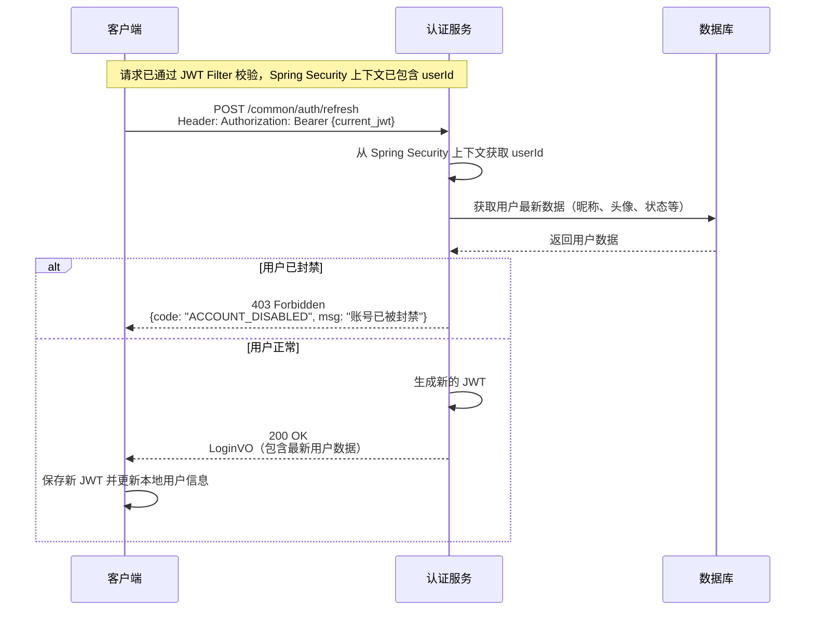
```mermaid
sequenceDiagram
    participant Client as 客户端
    participant Auth as 认证服务
    participant DB as 数据库

    Note over Client,Auth: 请求已通过 JWT Filter 校验，Spring Security 上下文已包含 userId

    Client->>Auth: POST /common/auth/refresh<br/>Header: Authorization: Bearer {current_jwt}
    Auth->>Auth: 从 Spring Security 上下文获取 userId
    Auth->>DB: 获取用户最新数据（昵称、头像、状态等）
    DB-->>Auth: 返回用户数据
    alt 用户已封禁
        Auth-->>Client: 403 Forbidden<br/>{code: "ACCOUNT_DISABLED", msg: "账号已被封禁"}
    else 用户正常
        Auth->>Auth: 生成新的 JWT
        Auth-->>Client: 200 OK<br/>LoginVO（包含最新用户数据）
        Client->>Client: 保存新 JWT 并更新本地用户信息
    end
```

## 用户管理

前缀为 `/common`（登录、图形码、校验码、注册）和 `/user`（个人信息管理）：

| 业务动作   | Controller 方法     | 路径                    | 方法   | 入参                     | 出参类              | 状态  |
| ------ | ----------------- | --------------------- | ---- | ---------------------- | ---------------- | --- |
| 密码登录   | `login`           | `/auth/login`         | POST | `LoginDTO`             | `LoginVO`        | ✅   |
| 获取图形码  | `getImageCaptcha` | `/auth/image-captcha` | GET  | 无                      | `ImageCaptchaVO` | ✅   |
| 发送校验码  | `sendVerifyCode`  | `/auth/verify-code`   | POST | `VerifyCodeDTO`        | `Void`           | 80% |
| 账号注册   | `register`        | `/auth/register`      | POST | `UserRegisterDTO`      | `Void`           | 90% |
| 获取个人资料 | `getProfile`      | `/user/profile`       | GET  | 无                      | `UserVO`         | ✅   |
| 修改个人资料 | `updateProfile`   | `/user/profile`       | PUT  | `UserProfileUpdateDTO` | `Void`           |     |

### 密码登录

之前已完成，这里暂时不添加

### 获取图形码/校验码

之前已完成，这里暂时不添加


### 账号注册

必须携带 username, email/phone（二选一），其它非敏感字段可选：

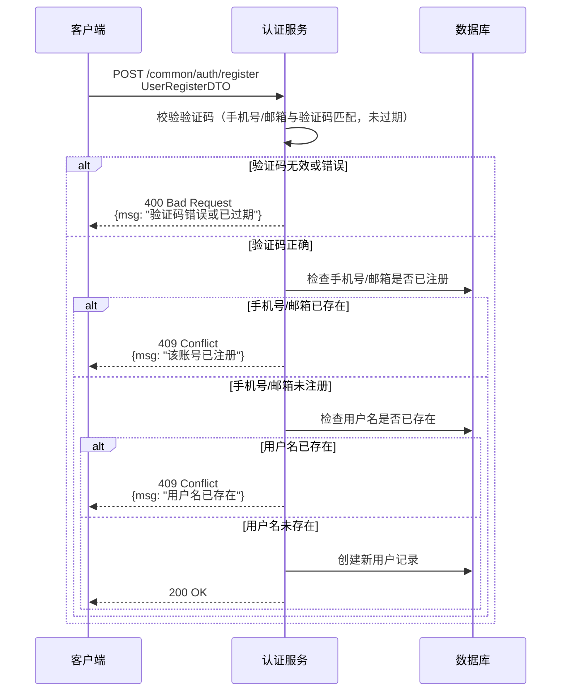
```mermaid
sequenceDiagram
    participant Client as 客户端
    participant Auth as 认证服务
    participant DB as 数据库

    Client->>Auth: POST /common/auth/register<br/>UserRegisterDTO
    Auth->>Auth: 校验验证码（手机号/邮箱与验证码匹配，未过期）
    alt 验证码无效或错误
        Auth-->>Client: 400 Bad Request<br/>{msg: "验证码错误或已过期"}
    else 验证码正确
        Auth->>DB: 检查手机号/邮箱是否已注册
        alt 手机号/邮箱已存在
            Auth-->>Client: 409 Conflict<br/>{msg: "该账号已注册"}
        else 手机号/邮箱未注册
            Auth->>DB: 检查用户名是否已存在
            alt 用户名已存在
                Auth-->>Client: 409 Conflict<br/>{msg: "用户名已存在"}
            else 用户名未存在
                Auth->>DB: 创建新用户记录
                Auth-->>Client: 200 OK
            end
        end
    end
```

>[!WRANING]
>如果有其它关联表，除了创建用户本身的表，还需要初始化创建**其它关联表**。

### 个人信息管理

#### 获取当前用户

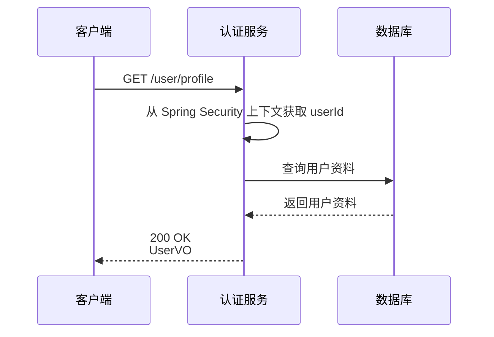
```mermaid
sequenceDiagram
    participant Client as 客户端
    participant Auth as 认证服务
    participant DB as 数据库

    Client->>Auth: GET /user/profile
    Auth->>Auth: 从 Spring Security 上下文获取 userId
    Auth->>DB: 查询用户资料
    DB-->>Auth: 返回用户资料
    Auth-->>Client: 200 OK<br/>UserVO
```

#### 修改个人资料

```json
// UserProfileUpdateDTO：修改资料请求参数
{
  "nickname": "新昵称",              // 昵称（可选）
  "avatar": "https://...",          // 头像URL（可选）
  "phone": "13900000000",           // 新手机号（可选，修改时需携带验证码）
  "email": "new@example.com",       // 新邮箱（可选，修改时需携带验证码）
  "verifyCode": "123456",           // 验证码（修改手机号/邮箱时必填）
  "oldPassword": "old_encrypted",   // 原密码（修改密码时必填）
  "newPassword": "new_encrypted"    // 新密码（可选）
}
```

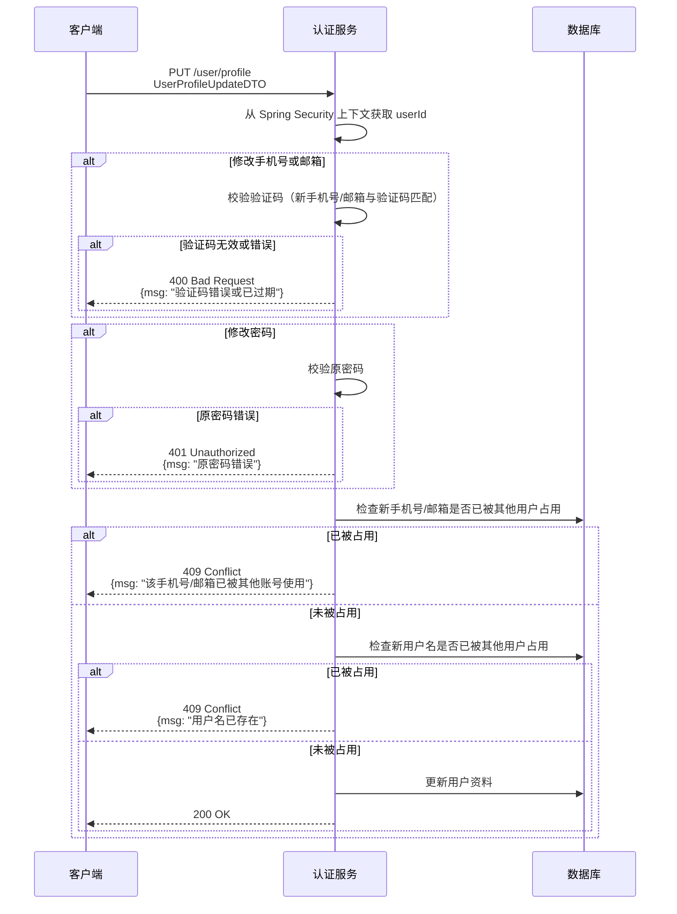
```mermaid
sequenceDiagram
    participant Client as 客户端
    participant Auth as 认证服务
    participant DB as 数据库

    Client->>Auth: PUT /user/profile<br/>UserProfileUpdateDTO
    Auth->>Auth: 从 Spring Security 上下文获取 userId

    alt 修改手机号或邮箱
        Auth->>Auth: 校验验证码（新手机号/邮箱与验证码匹配）
        alt 验证码无效或错误
            Auth-->>Client: 400 Bad Request<br/>{msg: "验证码错误或已过期"}
        end
    end

    alt 修改密码
        Auth->>Auth: 校验原密码
        alt 原密码错误
            Auth-->>Client: 401 Unauthorized<br/>{msg: "原密码错误"}
        end
    end

    Auth->>DB: 检查新手机号/邮箱是否已被其他用户占用
    alt 已被占用
        Auth-->>Client: 409 Conflict<br/>{msg: "该手机号/邮箱已被其他账号使用"}
    else 未被占用
        Auth->>DB: 检查新用户名是否已被其他用户占用
        alt 已被占用
            Auth-->>Client: 409 Conflict<br/>{msg: "用户名已存在"}
        else 未被占用
            Auth->>DB: 更新用户资料
            Auth-->>Client: 200 OK
        end
    end
```

## 音频播放

前缀为 `/common`（获取播放签名）和 `/user`（同步进度、获取详情）：

| 业务动作   | Controller 方法   | 路径            | 方法  | 入参                   | 出参类             | 状态  |
| ------ | --------------- | ------------- | --- | -------------------- | --------------- | --- |
| 获取播放签名 | `getStreamSign` | `/file/sign`  | GET | `audioId`            | `String`        |     |
| 同步播放进度 | `updateHistory` | `/history`    | PUT | `HistoryProgressDTO` | `Void`          |     |
| 获取音频详情 | `getAudio`      | `/audio/{id}` | GET | 路径参数 `id`            | `AudioDetailVO` |     |

### 获取播放签名

签名就是临时 URL：

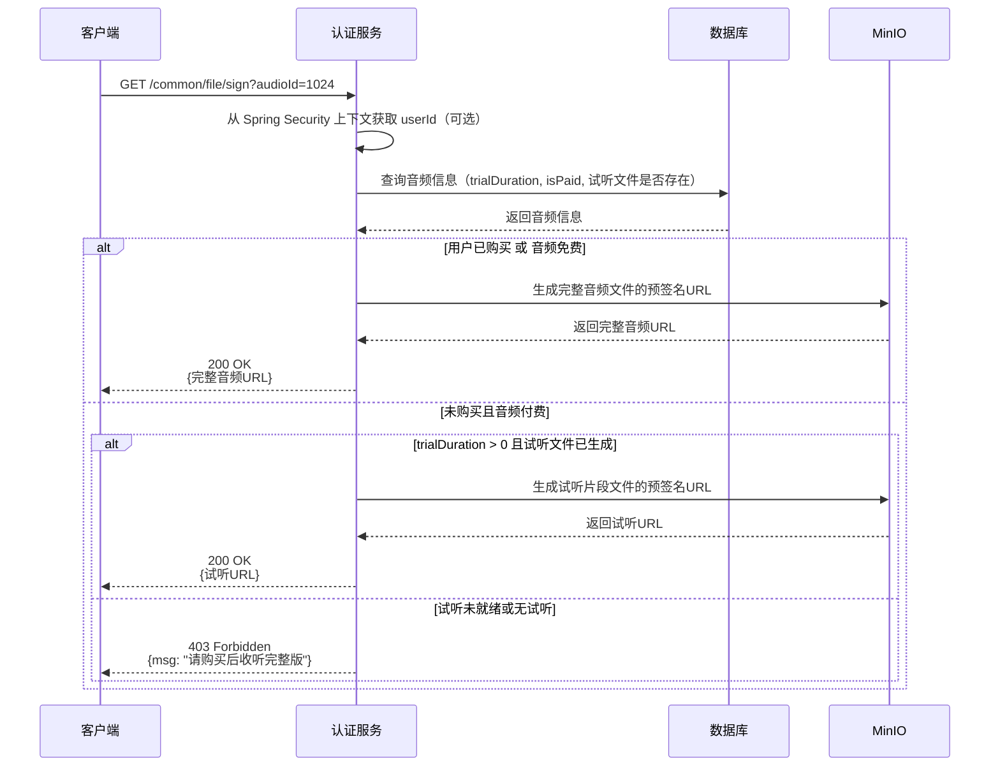
```mermaid
sequenceDiagram
    participant Client as 客户端
    participant Auth as 认证服务
    participant DB as 数据库
    participant Minio as MinIO

    Client->>Auth: GET /common/file/sign?audioId=1024
    Auth->>Auth: 从 Spring Security 上下文获取 userId（可选）
    Auth->>DB: 查询音频信息（trialDuration, isPaid, 试听文件是否存在）
    DB-->>Auth: 返回音频信息

    alt 用户已购买 或 音频免费
        Auth->>Minio: 生成完整音频文件的预签名URL
        Minio-->>Auth: 返回完整音频URL
        Auth-->>Client: 200 OK<br/>{完整音频URL}
    else 未购买且音频付费
        alt trialDuration > 0 且试听文件已生成
            Auth->>Minio: 生成试听片段文件的预签名URL
            Minio-->>Auth: 返回试听URL
            Auth-->>Client: 200 OK<br/>{试听URL}
        else 试听未就绪或无试听
            Auth-->>Client: 403 Forbidden<br/>{msg: "请购买后收听完整版"}
        end
    end
```

> [!NOTE] 观看次数的实现
> `playCount`（播放次数）要在获取播放签名接口中累加。每次前端调用 `/common/file/sign` 获取播放 URL 时，后端判断为一次有效播放请求，将对应音频的 `play_count` 字段 +1。
> 
> **注意**：为防止恶意刷量，需要增加限流（同一用户 对同一音频短时间内多次请求只计一次），用 Redis 记录 `user:play:counted:{userId}:{audioId}`，过期时间设为 1 小时。

### 同步播放进度

```json
// HistoryProgressDTO：播放进度
{
  "audioId": 1024,
  "progress": 120            // 当前播放进度（秒）
}
```

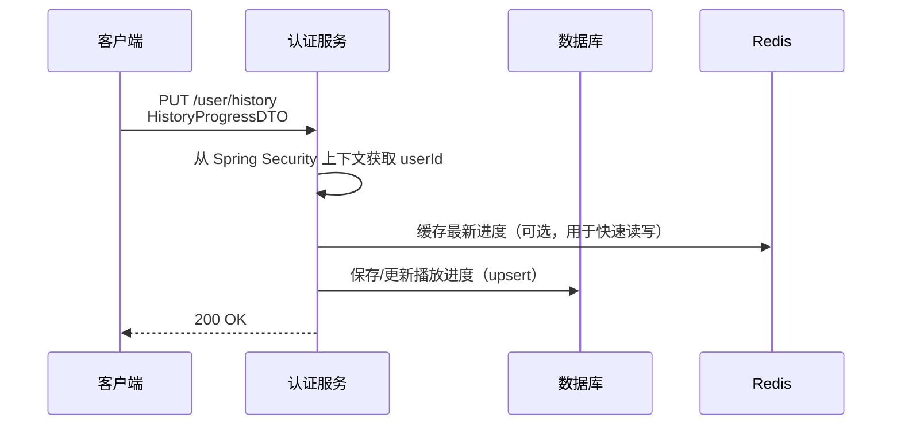
```mermaid
sequenceDiagram
    participant Client as 客户端
    participant Auth as 认证服务
    participant DB as 数据库
    participant Redis as Redis

    Client->>Auth: PUT /user/history<br/>HistoryProgressDTO
    Auth->>Auth: 从 Spring Security 上下文获取 userId
    Auth->>Redis: 缓存最新进度（可选，用于快速读写）
    Auth->>DB: 保存/更新播放进度（upsert）
    Auth-->>Client: 200 OK
```

### 获取音频详情

```json
// AudioDetailVO
{
  "id": 1024,
  "title": "Spring Boot 核心原理解析",
  "coverUrl": "https://...",
  "duration": 3600,
  "trialDuration": 30,
  "isPaid": true,
  "price": 19.90,
  "isPurchased": false,
  "progress": 120, // 上次播放进度（秒），0 表示无记录
  "creator": {
    "id": 88,
    "nickname": "后端架构师",
    "avatar": "https://..."
  },
  "stats": {
    "playCount": 1205,
    "collectCount": 340,
    "likeCount": 890
  }
}
```

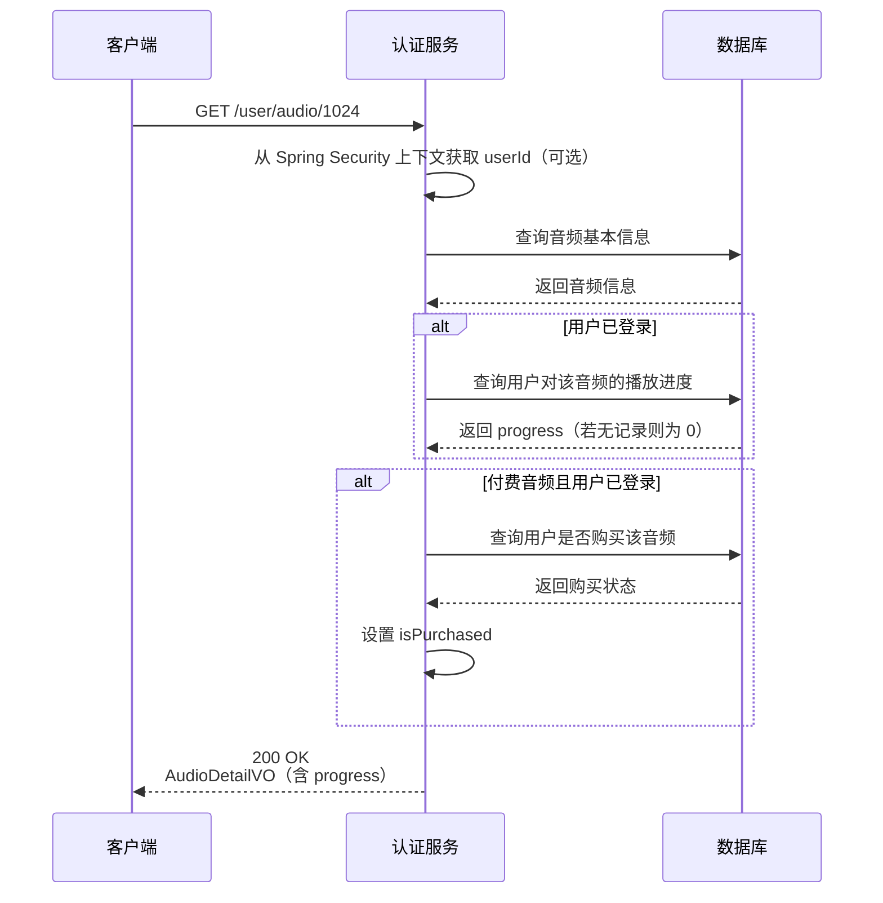
```mermaid
sequenceDiagram
    participant Client as 客户端
    participant Auth as 认证服务
    participant DB as 数据库

    Client->>Auth: GET /user/audio/1024
    Auth->>Auth: 从 Spring Security 上下文获取 userId（可选）
    Auth->>DB: 查询音频基本信息
    DB-->>Auth: 返回音频信息
    alt 用户已登录
        Auth->>DB: 查询用户对该音频的播放进度
        DB-->>Auth: 返回 progress（若无记录则为 0）
    end
    alt 付费音频且用户已登录
        Auth->>DB: 查询用户是否购买该音频
        DB-->>Auth: 返回购买状态
        Auth->>Auth: 设置 isPurchased
    end
    Auth-->>Client: 200 OK<br/>AudioDetailVO（含 progress）
```

## 音频收藏

支持自定义收藏夹，音频可收藏至指定收藏夹，前缀都为 `/user`：

| 业务动作     | Controller 方法          | 路径                            | 方法     | 入参                  | 出参类              | 状态  |
| -------- | ---------------------- | ----------------------------- | ------ | ------------------- | ---------------- | --- |
| 收藏/取消收藏  | `saveAudioAction`      | `/audio/action`               | POST   | `FavoriteActionDTO` | `Void`        |     |
| 创建收藏夹    | `saveFavoriteFolder`   | `/favorite/folder`            | POST   | `FolderDTO`         | `Void`           |     |
| 获取收藏夹列表  | `getFolderList`        | `/favorite/folder/list`       | GET    | 无                   | `List<FolderVO>` |     |
| 分页查询收藏音频 | `getFavoritePage`      | `/favorite/page`              | GET    | `FavoriteQuery`     | `IPage<AudioVO>` |     |
| 移除收藏     | `deleteFavorite`       | `/favorite`                   | DELETE | `FavoriteDeleteDTO` | `Void`           |     |
| 删除收藏夹    | `deleteFavoriteFolder` | `/favorite/folder/{folderId}` | DELETE | 路径参数 `folderId`     | `Void`           |     |

### 收藏/取消收藏

```json
// FavoriteActionDTO：收藏/取消收藏请求参数
{
  "audioId": 1024,           // 音频ID（必填）
  "folderId": 1,             // 收藏夹ID（可选，不传则收藏至默认收藏夹）
  "action": "COLLECT"        // COLLECT（收藏）/ UNCOLLECT（取消收藏）
}
```

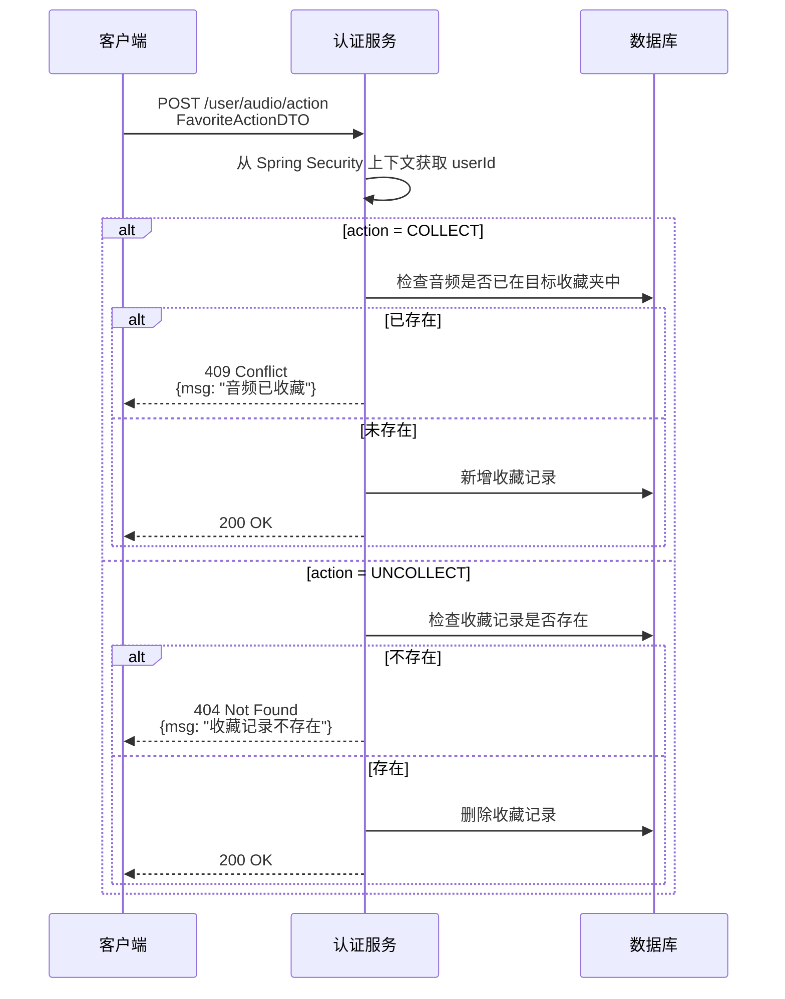
```mermaid
sequenceDiagram
    participant Client as 客户端
    participant Auth as 认证服务
    participant DB as 数据库

    Client->>Auth: POST /user/audio/action<br/>FavoriteActionDTO
    Auth->>Auth: 从 Spring Security 上下文获取 userId

    alt action = COLLECT
        Auth->>DB: 检查音频是否已在目标收藏夹中
        alt 已存在
            Auth-->>Client: 409 Conflict<br/>{msg: "音频已收藏"}
        else 未存在
            Auth->>DB: 新增收藏记录
            Auth-->>Client: 200 OK
        end
    else action = UNCOLLECT
        Auth->>DB: 检查收藏记录是否存在
        alt 不存在
            Auth-->>Client: 404 Not Found<br/>{msg: "收藏记录不存在"}
        else 存在
            Auth->>DB: 删除收藏记录
            Auth-->>Client: 200 OK
        end
    end
```

### 创建收藏夹

```json
// FolderDTO：创建收藏夹请求参数
{
  "name": "我的最爱",           // 收藏夹名称（必填）
  "description": "精选音频"     // 描述（可选）
}
```

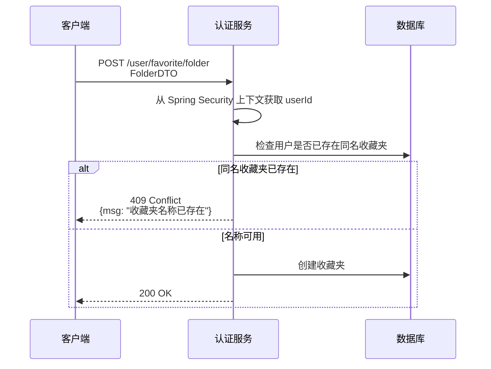
```mermaid
sequenceDiagram
    participant Client as 客户端
    participant Auth as 认证服务
    participant DB as 数据库

    Client->>Auth: POST /user/favorite/folder<br/>FolderDTO
    Auth->>Auth: 从 Spring Security 上下文获取 userId
    Auth->>DB: 检查用户是否已存在同名收藏夹
    alt 同名收藏夹已存在
        Auth-->>Client: 409 Conflict<br/>{msg: "收藏夹名称已存在"}
    else 名称可用
        Auth->>DB: 创建收藏夹
        Auth-->>Client: 200 OK
    end
```

### 获取收藏夹列表

```json
// FolderVO：收藏夹信息
{
  "folderId": 1,
  "name": "我的最爱",
  "description": "精选音频",
  "audioCount": 15,
  "createTime": 1711425600000
}
```

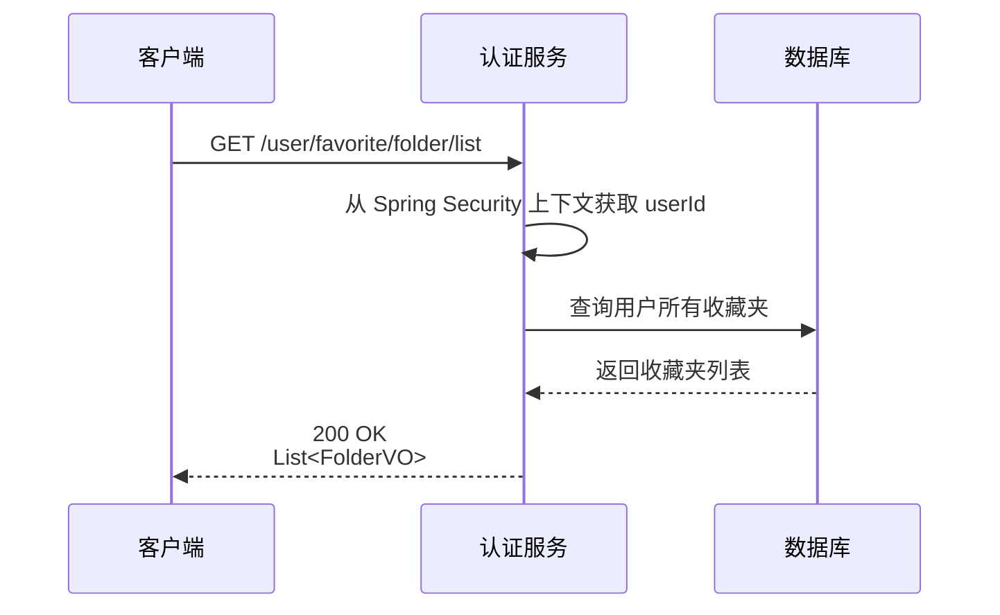
```mermaid
sequenceDiagram
    participant Client as 客户端
    participant Auth as 认证服务
    participant DB as 数据库

    Client->>Auth: GET /user/favorite/folder/list
    Auth->>Auth: 从 Spring Security 上下文获取 userId
    Auth->>DB: 查询用户所有收藏夹
    DB-->>Auth: 返回收藏夹列表
    Auth-->>Client: 200 OK<br/>List<FolderVO>
```

### 分页查询收藏音频

> 后续所有分页查询参数都从 `PageQuery` 来继承过来，如果当前项目还没有就先去定义。

```json
// FavoriteQuery 继承自 PageQuery
{
  "folderId": 1,
  "pageNum": 1,      // 当前页，默认 1
  "pageSize": 10     // 每页显示条数，默认 10
}
```

出参用 `IPage<AudioVO>` 使用 MyBatis-Plus 的 `IPage` 类就行。

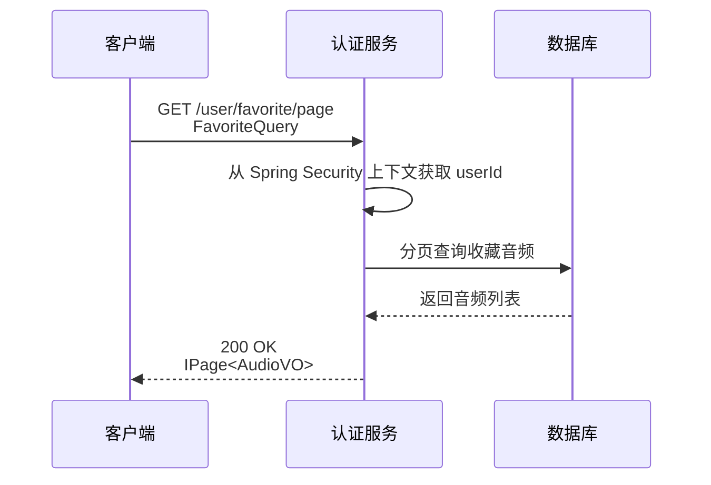
```mermaid
sequenceDiagram
    participant Client as 客户端
    participant Auth as 认证服务
    participant DB as 数据库

    Client->>Auth: GET /user/favorite/page<br/>FavoriteQuery
    Auth->>Auth: 从 Spring Security 上下文获取 userId
    Auth->>DB: 分页查询收藏音频
    DB-->>Auth: 返回音频列表
    Auth-->>Client: 200 OK<br/>IPage<AudioVO>
```

### 移除收藏

```json
// FavoriteDeleteDTO
{
  "audioId": 1024,
  "folderId": 1
}
```

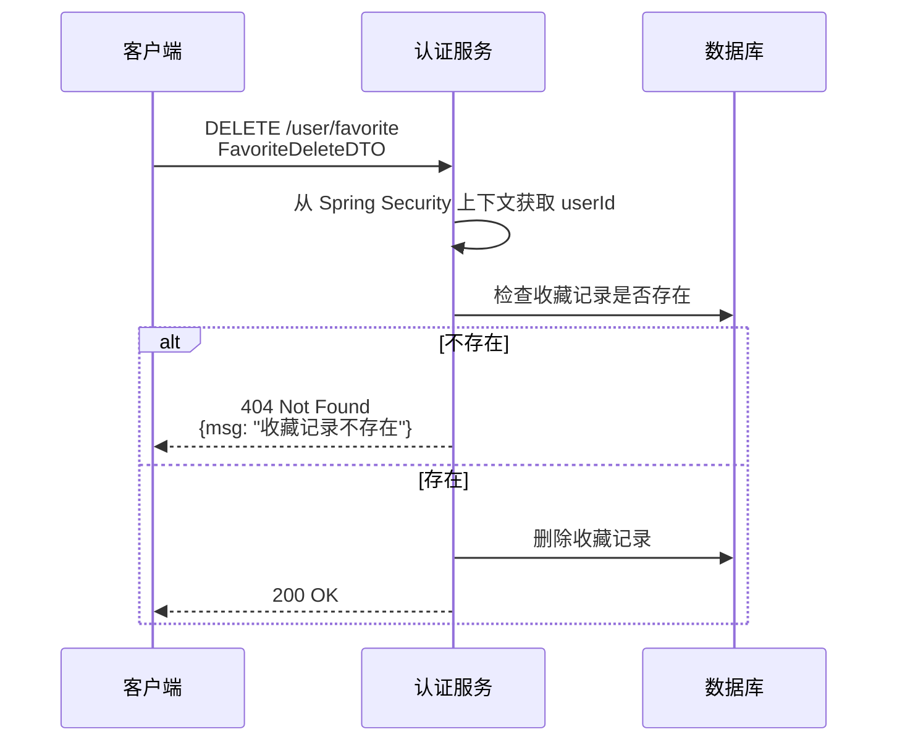
```mermaid
sequenceDiagram
    participant Client as 客户端
    participant Auth as 认证服务
    participant DB as 数据库

    Client->>Auth: DELETE /user/favorite<br/>FavoriteDeleteDTO
    Auth->>Auth: 从 Spring Security 上下文获取 userId
    Auth->>DB: 检查收藏记录是否存在
    alt 不存在
        Auth-->>Client: 404 Not Found<br/>{msg: "收藏记录不存在"}
    else 存在
        Auth->>DB: 删除收藏记录
        Auth-->>Client: 200 OK
    end
```

### 删除收藏夹

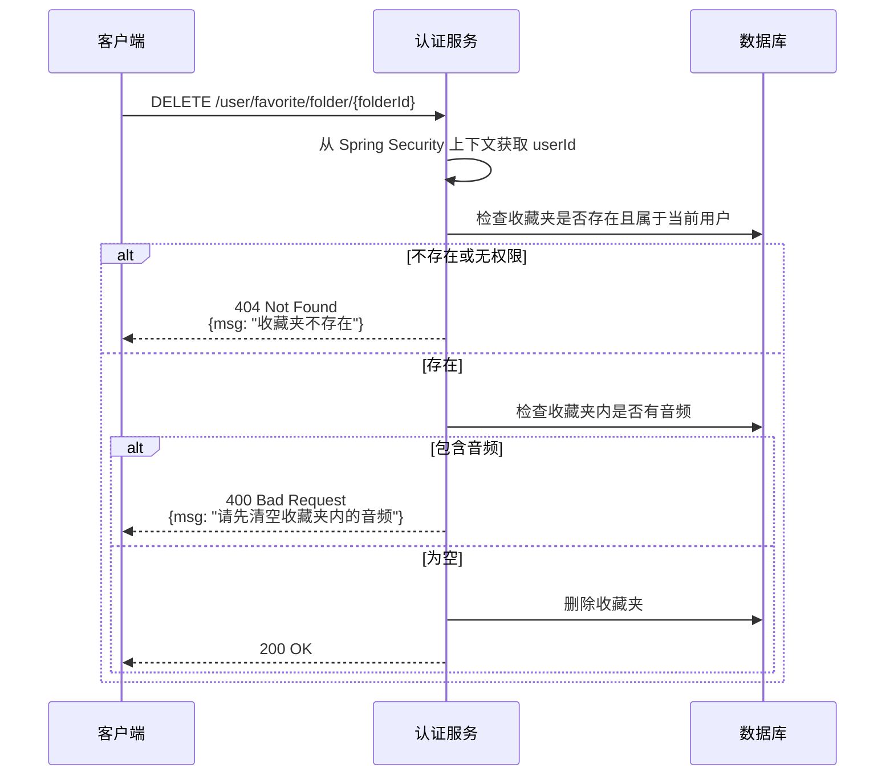
```mermaid
sequenceDiagram
    participant Client as 客户端
    participant Auth as 认证服务
    participant DB as 数据库

    Client->>Auth: DELETE /user/favorite/folder/{folderId}
    Auth->>Auth: 从 Spring Security 上下文获取 userId
    Auth->>DB: 检查收藏夹是否存在且属于当前用户
    alt 不存在或无权限
        Auth-->>Client: 404 Not Found<br/>{msg: "收藏夹不存在"}
    else 存在
        Auth->>DB: 检查收藏夹内是否有音频
        alt 包含音频
            Auth-->>Client: 400 Bad Request<br/>{msg: "请先清空收藏夹内的音频"}
        else 为空
            Auth->>DB: 删除收藏夹
            Auth-->>Client: 200 OK
        end
    end
```

## 喜欢

可将音频标记为「喜欢」，并在收藏文件夹管理/查看。前缀为 `/user`：

| 业务动作         | Controller 方法 | 路径          | 方法 | 入参            | 出参类          | 状态 |
| ---------------- | --------------- | ------------- | ---- | --------------- | --------------- | ---- |
| 喜欢/取消喜欢    | `saveAudioLike` | `/audio/like` | POST | `LikeActionDTO` | `Void`          |      |
| 分页查询喜欢音频 | `getLikePage`   | `/like/page`  | GET  | `PageQuery`     | `IPage<AudioVO>` |      |

### 喜欢/取消喜欢

```json
// LikeActionDTO：喜欢/取消喜欢请求参数
{
  "audioId": 1024,           // 音频ID（必填）
  "action": "LIKE"           // LIKE（喜欢）/ UNLIKE（取消喜欢）
}
```

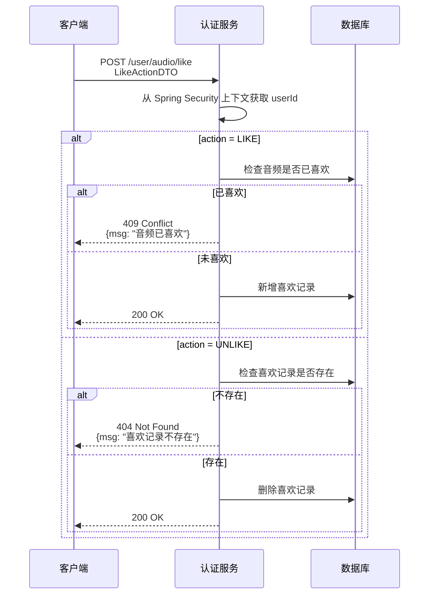
```mermaid
sequenceDiagram
    participant Client as 客户端
    participant Auth as 认证服务
    participant DB as 数据库

    Client->>Auth: POST /user/audio/like<br/>LikeActionDTO
    Auth->>Auth: 从 Spring Security 上下文获取 userId

    alt action = LIKE
        Auth->>DB: 检查音频是否已喜欢
        alt 已喜欢
            Auth-->>Client: 409 Conflict<br/>{msg: "音频已喜欢"}
        else 未喜欢
            Auth->>DB: 新增喜欢记录
            Auth-->>Client: 200 OK
        end
    else action = UNLIKE
        Auth->>DB: 检查喜欢记录是否存在
        alt 不存在
            Auth-->>Client: 404 Not Found<br/>{msg: "喜欢记录不存在"}
        else 存在
            Auth->>DB: 删除喜欢记录
            Auth-->>Client: 200 OK
        end
    end
```

### 分页查询

```json
// PageQuery：分页查询参数
{
  "pageNum": 1,      // 当前页，默认 1
  "pageSize": 10     // 每页显示条数，默认 10
}
```

出参使用 Mybatis Plus 的 IPage 类。

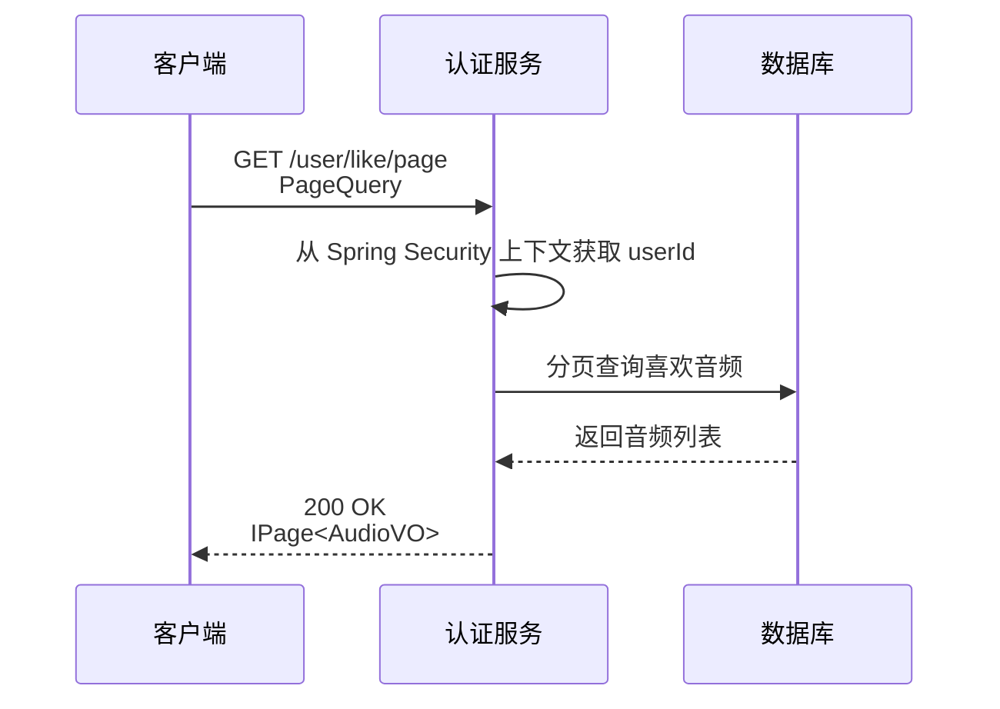
```mermaid
sequenceDiagram
    participant Client as 客户端
    participant Auth as 认证服务
    participant DB as 数据库

    Client->>Auth: GET /user/like/page<br/>PageQuery
    Auth->>Auth: 从 Spring Security 上下文获取 userId
    Auth->>DB: 分页查询喜欢音频
    DB-->>Auth: 返回音频列表
    Auth-->>Client: 200 OK<br/>IPage<AudioVO>
```

## 历史记录

显示用户最近播放的音频页面。前缀为 `/user`：

| 业务动作     | Controller 方法    | 路径                   | 方法   | 入参             | 出参类             | 状态  |
| -------- | ---------------- | -------------------- | ---- | -------------- | --------------- | --- |
| 记录播放     | `saveHistory`    | `/history/{audioId}` | POST | 路径参数 `audioId` | `Void`          |     |
| 分页查询历史记录 | `getHistoryPage` | `/history/page`      | GET  | `PageQuery`    | `IPage<AudioVO>` |     |

### 记录播放

前端定期向后端发送该请求。

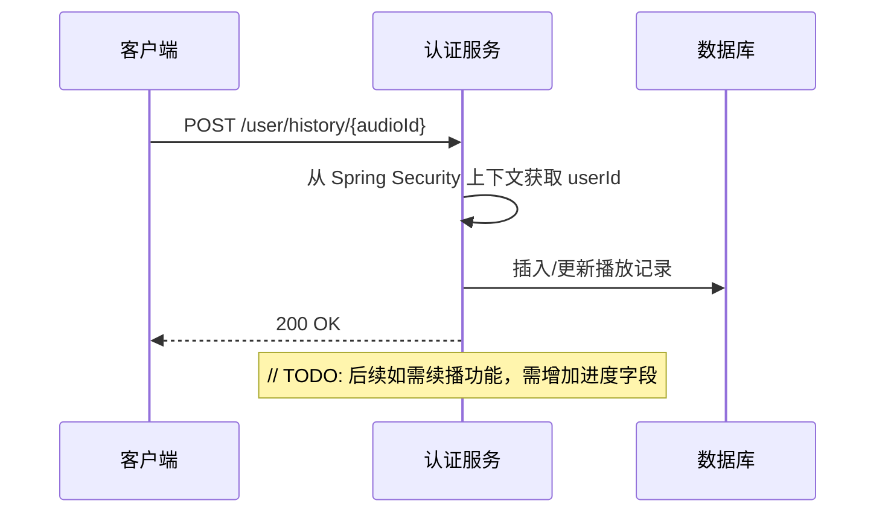
```mermaid
sequenceDiagram
    participant Client as 客户端
    participant Auth as 认证服务
    participant DB as 数据库

    Client->>Auth: POST /user/history/{audioId}
    Auth->>Auth: 从 Spring Security 上下文获取 userId
    Auth->>DB: 插入/更新播放记录
    Auth-->>Client: 200 OK
		
	Note over Auth: // TODO: 后续如需续播功能，需增加进度字段
```

> 其他细节：
> 
> 1. 播放记录表在后端需要定期清理。
> 2. 后续如需续播功能，需增加进度字段

### 分页查询

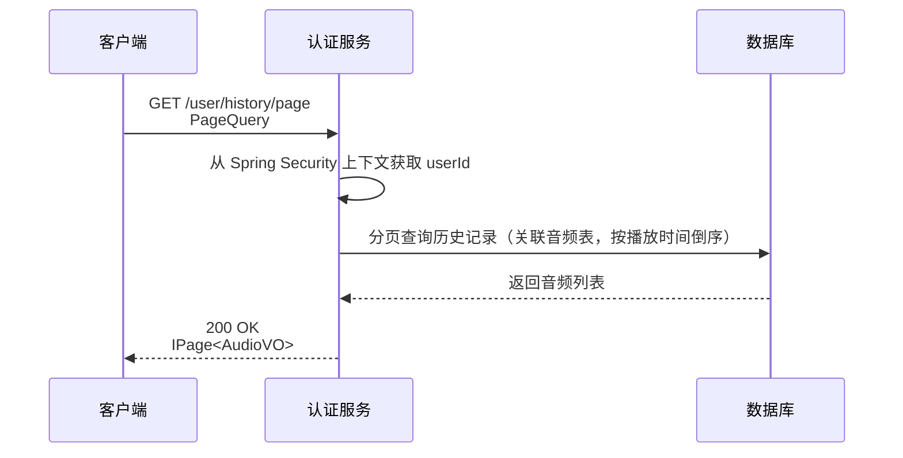
```mermaid
sequenceDiagram
    participant Client as 客户端
    participant Auth as 认证服务
    participant DB as 数据库

    Client->>Auth: GET /user/history/page<br/>PageQuery
    Auth->>Auth: 从 Spring Security 上下文获取 userId
    Auth->>DB: 分页查询历史记录（关联音频表，按播放时间倒序）
    DB-->>Auth: 返回音频列表
    Auth-->>Client: 200 OK<br/>IPage<AudioVO>
```

## 评论

支持用户在音频下发布/查看评论，支持点赞与回复。前缀为 `/user`：

| 业务动作      | Controller 方法    | 路径               | 方法   | 入参                | 出参类                | 状态  |
| --------- | ---------------- | ---------------- | ---- | ----------------- | ------------------ | --- |
| 发表评论      | `saveComment`    | `/comment`       | POST | `CommentDTO`      | `Void`             |     |
| 评论列表      | `getCommentPage` | `/comment/page`  | GET  | `CommentQuery`    | `IPage<CommentVO>` |     |
| 点赞/取消点赞评论 | `likeComment`    | `/comment/like`  | POST | `CommentLikeDTO`  | `Void`             |     |
| 回复评论      | `replyComment`   | `/comment/reply` | POST | `CommentReplyDTO` | `Void`             |     |

评论只有顶级评论和回复评论。

### 发表评论

```json
// CommentDTO：发表评论
{
  "audioId": 1024,           // 音频ID（必填）
  "content": "讲得真好！",    // 评论内容（必填）
  "parentId": 0              // 父评论ID，0表示自己为顶级评论（可选）
}
```

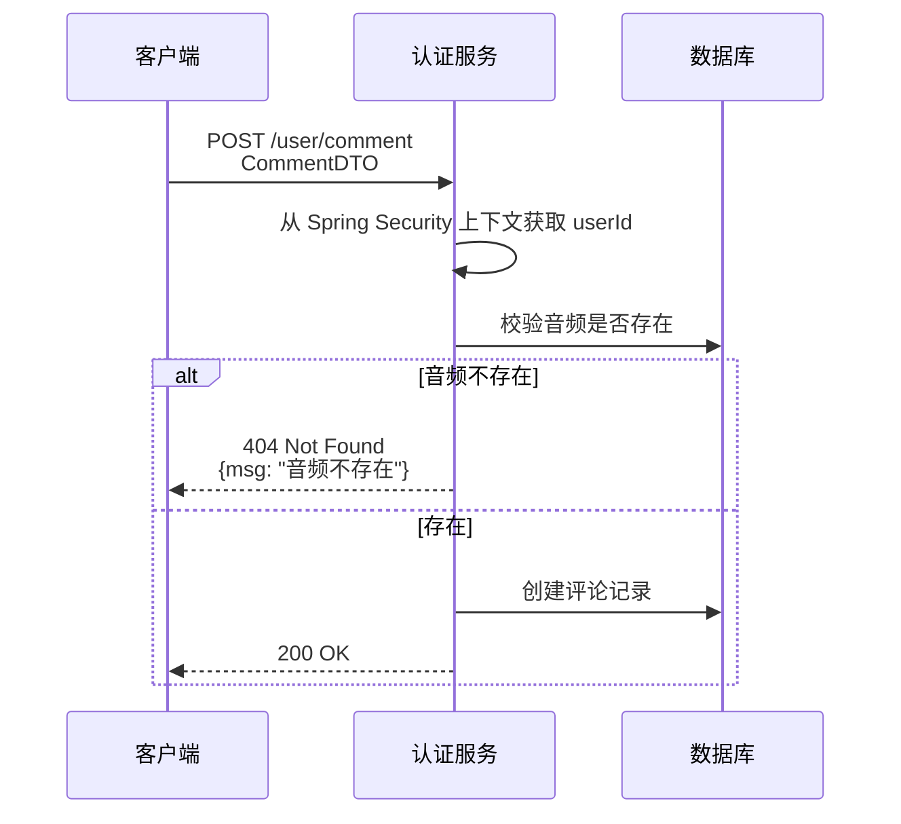
```mermaid
sequenceDiagram
    participant Client as 客户端
    participant Auth as 认证服务
    participant DB as 数据库

    Client->>Auth: POST /user/comment<br/>CommentDTO
    Auth->>Auth: 从 Spring Security 上下文获取 userId
    Auth->>DB: 校验音频是否存在
    alt 音频不存在
        Auth-->>Client: 404 Not Found<br/>{msg: "音频不存在"}
    else 存在
        Auth->>DB: 创建评论记录
        Auth-->>Client: 200 OK
    end
```

### 点赞/取消点赞 

```json
// CommentLikeDTO：点赞/取消点赞
{
  "commentId": 556,          // 评论ID（必填）
  "action": "LIKE"           // LIKE / UNLIKE
}
```

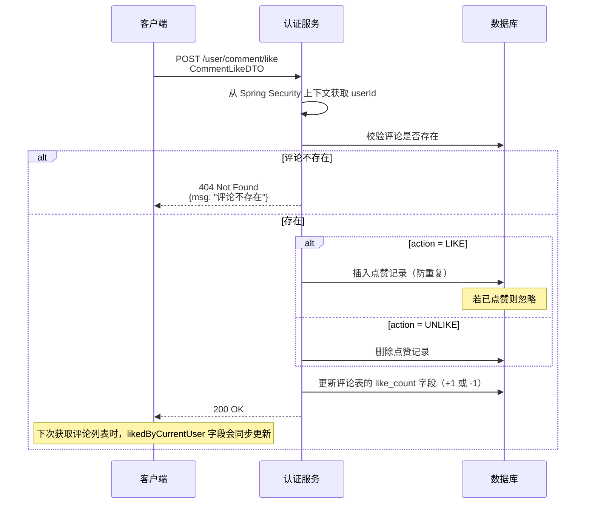
```mermaid
sequenceDiagram
    participant Client as 客户端
    participant Auth as 认证服务
    participant DB as 数据库

    Client->>Auth: POST /user/comment/like<br/>CommentLikeDTO
    Auth->>Auth: 从 Spring Security 上下文获取 userId
    Auth->>DB: 校验评论是否存在
    alt 评论不存在
        Auth-->>Client: 404 Not Found<br/>{msg: "评论不存在"}
    else 存在
        alt action = LIKE
            Auth->>DB: 插入点赞记录（防重复）
            Note over DB: 若已点赞则忽略
        else action = UNLIKE
            Auth->>DB: 删除点赞记录
        end
        Auth->>DB: 更新评论表的 like_count 字段（+1 或 -1）
        Auth-->>Client: 200 OK
        Note over Client: 下次获取评论列表时，likedByCurrentUser 字段会同步更新
    end
```

### 评论列表

```json
// CommentQuery：继承 PageQuery
{
  "audioId": 1024,           // 音频ID（必填）
  "pageNum": 1,              // 继承自 PageQuery
  "pageSize": 10             // 继承自 PageQuery
}
```

```json
{ // CommentVO
	"id": 556,
	"userId": 1001,
	"nickname": "听众_8848",
	"avatar": "https://...",
	"content": "讲得真好！",
	"likeCount": 12,
	"likedByCurrentUser": true,
	"createTime": 1711425600000,
	"replyList": [ // 嵌套它自己
		{
			"id": 557,
			"userId": 88,
			"nickname": "后端架构师",
	       "avatar": "https://...",
			"content": "谢谢支持",
			"createTime": 1711425605000
	       "likeCount": 12,
			"likedByCurrentUser": true,
		}
	]
}
```

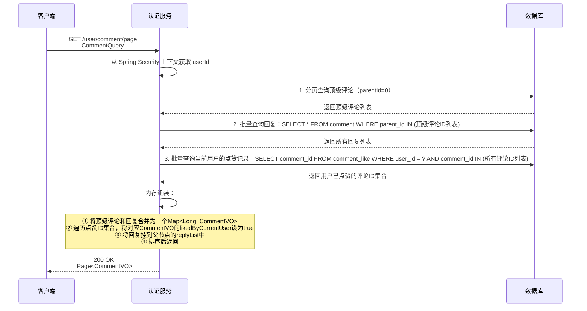
```mermaid
sequenceDiagram
    participant Client as 客户端
    participant Auth as 认证服务
    participant DB as 数据库

    Client->>Auth: GET /user/comment/page<br/>CommentQuery
    Auth->>Auth: 从 Spring Security 上下文获取 userId
    Auth->>DB: 1. 分页查询顶级评论（parentId=0）
    DB-->>Auth: 返回顶级评论列表
    Auth->>DB: 2. 批量查询回复：SELECT * FROM comment WHERE parent_id IN (顶级评论ID列表)
    DB-->>Auth: 返回所有回复列表
    Auth->>DB: 3. 批量查询当前用户的点赞记录：SELECT comment_id FROM comment_like WHERE user_id = ? AND comment_id IN (所有评论ID列表)
    DB-->>Auth: 返回用户已点赞的评论ID集合
    Auth->>Auth: 内存组装：
    Note over Auth: ① 将顶级评论和回复合并为一个Map<Long, CommentVO><br/>② 遍历点赞ID集合，将对应CommentVO的likedByCurrentUser设为true<br/>③ 将回复挂到父节点的replyList中<br/>④ 排序后返回
    Auth-->>Client: 200 OK<br/>IPage<CommentVO>
```

### 回复评论

```json
// CommentReplyDTO：回复评论
{
  "commentId": 556,          // 被回复的评论ID（必填）
  "content": "谢谢支持",      // 回复内容（必填）
  "replyToUserId": 1001      // 被回复的用户ID（可选，用于通知）
}
```

```mermaid
sequenceDiagram
    participant Client as 客户端
    participant Auth as 认证服务
    participant DB as 数据库

    Client->>Auth: POST /user/comment/reply<br/>CommentReplyDTO
    Auth->>Auth: 从 Spring Security 上下文获取 userId
    Auth->>DB: 校验被回复的评论是否存在
    alt 评论不存在
        Auth-->>Client: 404 Not Found<br/>{msg: "评论不存在"}
    else 存在
        Auth->>DB: 插入回复记录（parent_id = commentId）
        Auth-->>Client: 200 OK
    end
```

## 音频搜索

支持根据标题/创作者/音频文字搜索音频。前缀为 `/user`：

| 业务动作 | Controller 方法 | 路径              | 方法  | 入参                 | 出参类              | 状态  |
| ---- | ------------- | --------------- | --- | ------------------ | ---------------- | --- |
| 搜索音频 | `searchAudio` | `/audio/search` | GET | `AudioSearchQuery` | `IPage<AudioVO>` |     |

```json
// AudioSearchQuery：继承 PageQuery
{
  "keyword": "Spring",           // 搜索关键词（必填）
  "searchType": "TITLE",         // TITLE / CREATOR / TRANSCRIPT，默认 TITLE
  "pageNum": 1,
  "pageSize": 10

```

```mermaid
sequenceDiagram
    participant Client as 客户端
    participant Auth as 认证服务
    participant DB as 数据库

    Client->>Auth: GET /user/audio/search<br/>AudioSearchQuery

    alt searchType = TITLE
        Auth->>DB: 按标题模糊查询
    else searchType = CREATOR
        Auth->>DB: 按创作者昵称模糊查询
    else searchType = TRANSCRIPT
        Auth->>DB: 按转写文本模糊查询
    end

    DB-->>Auth: 返回音频列表
    Auth-->>Client: 200 OK<br/>IPage<AudioVO>

    Note over Auth: // TODO: 后续接入 Elasticsearch 提升搜索性
```

## 离线下载

支持离线下载并收听音频，主要是前端方面的工作。前缀为 `/user`：

| 业务动作   | Controller 方法    | 路径                          | 方法  | 入参             | 出参类      | 状态  |
| ------ | ---------------- | --------------------------- | --- | -------------- | -------- | --- |
| 获取下载链接 | `getDownloadUrl` | `/audio/download/{audioId}` | GET | 路径参数 `audioId` | `String` |     |

```mermaid
sequenceDiagram
    participant Client as 客户端
    participant Auth as 认证服务
    participant Minio as MinIO
    participant DB as 数据库

    Client->>Auth: GET /user/audio/download/{audioId}
    Auth->>Auth: 从 Spring Security 上下文获取 userId
    Auth->>DB: 查询音频文件路径 + 校验用户权限
    alt 无权限
        Auth-->>Client: 403 Forbidden<br/>{msg: "无权下载该音频"}
    else 有权限
        Auth->>Minio: 生成预签名下载 URL（有时效）
        Minio-->>Auth: 返回预签名 URL
        Auth-->>Client: 200 OK<br/>{url: "https://minio..."}
        Note over Client: 客户端使用该 URL 下载并缓存到 IndexedDB
        Note over Auth: // TODO: 后续接入加密存储
    end
```

## 创作者申请

支持普通用户申请为创作者。前缀为 `/user`：

| 业务动作     | Controller 方法  | 路径                    | 方法 | 入参              | 出参类           | 状态 |
| ------------ | ---------------- | ----------------------- | ---- | ----------------- | ---------------- | ---- |
| 提交申请     | `applyCreator`   | `/creator/apply`        | POST | `CreatorApplyDTO` | `Void`           |      |
| 查询申请状态 | `getApplyStatus` | `/creator/apply/status` | GET  | 无                | `CreatorApplyVO` |      |

### 提交申请

```json
// CreatorApplyDTO：创作者申请参数
{
  "realName": "张三",           // 真实姓名（必填）
  "phone": "13800000000",      // 联系电话（必填）
  "intro": "资深后端工程师，擅长技术分享",  // 个人简介（可选）
	...
  "attachment": "https://..."  // 证明材料链接（可选）
}
```

```mermaid
sequenceDiagram
    participant Client as 客户端
    participant Auth as 认证服务
    participant DB as 数据库

    Client->>Auth: POST /user/creator/apply<br/>CreatorApplyDTO
    Auth->>Auth: 从 Spring Security 上下文获取 userId
    Auth->>DB: 检查用户是否已是创作者
    alt 已是创作者
        Auth-->>Client: 400 Bad Request<br/>{msg: "您已是创作者"}
    else 非创作者
        Auth->>DB: 检查是否有进行中的申请
        alt 已有待审核申请
            Auth-->>Client: 409 Conflict<br/>{msg: "已有申请正在审核中"}
        else 无申请
            Auth->>DB: 创建创作者申请记录（状态：待审核）
            Auth-->>Client: 200 OK
        end
    end
```

### 查询申请状态

```json
// CreatorApplyVO：申请状态
{
  "status": "PENDING",         // PENDING / APPROVED / REJECTED
  "reason": null,              // 驳回原因（仅 REJECTED 时有值）
  "applyTime": 1711425600000   // 申请时间
}
```

```mermaid
sequenceDiagram
    participant Client as 客户端
    participant Auth as 认证服务
    participant DB as 数据库

    Client->>Auth: GET /user/creator/apply/status
    Auth->>Auth: 从 Spring Security 上下文获取 userId
    Auth->>DB: 查询最新创作者申请记录
    DB-->>Auth: 返回申请状态
    Auth-->>Client: 200 OK<br/>CreatorApplyVO
```

## 其它接口

见[接口文档-02](接口文档-02.md)。