主要包含创作者和管理员接口。

## 稿件发布

前缀为 `/creator`：

| 业务动作     | Controller 方法 | 路径                  | 方法 | 入参            | 出参类           | 状态 |
| ------------ | --------------- | --------------------- | ---- | --------------- | ---------------- | ---- |
| 上传音频     | `uploadAudio`   | `/audio/upload`       | POST | `MultipartFile` | `String`         |      |
| 上传封面     | `uploadCover`   | `/audio/cover/upload` | POST | `MultipartFile` | `UploadResultVO` |      |
| 发布音频稿件 | `saveAudio`     | `/audio`              | POST | `AudioDTO`      | `AudioPublishVO` |      |


### 上传音频

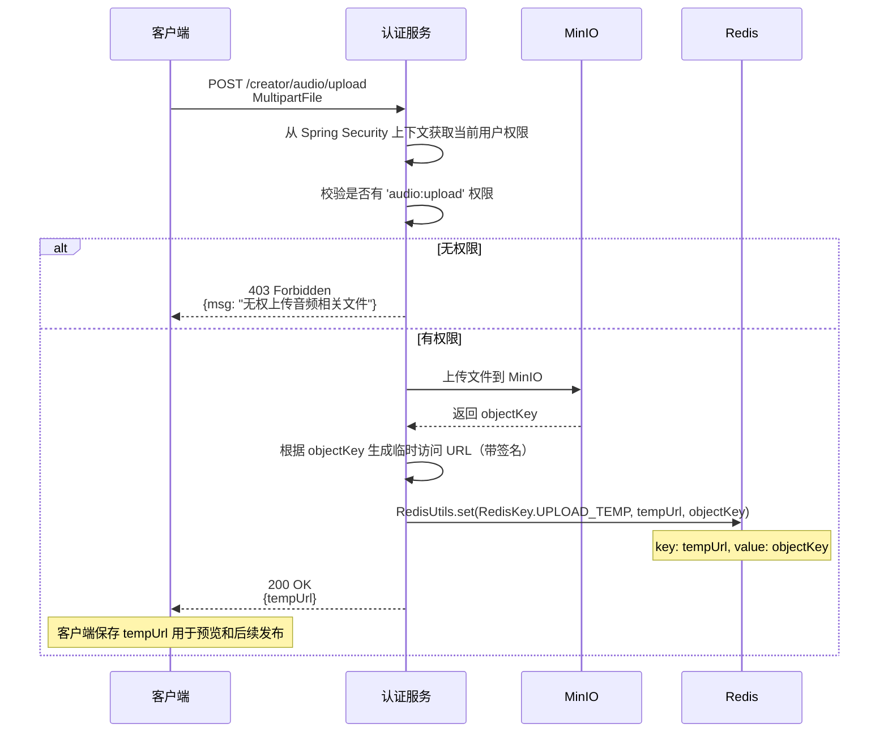
```mermaid
sequenceDiagram
    participant Client as 客户端
    participant Auth as 认证服务
    participant Minio as MinIO
    participant Redis as Redis

    Client->>Auth: POST /creator/audio/upload<br/>MultipartFile
    Auth->>Auth: 从 Spring Security 上下文获取当前用户权限
    Auth->>Auth: 校验是否有 'audio:upload' 权限
    alt 无权限
        Auth-->>Client: 403 Forbidden<br/>{msg: "无权上传音频相关文件"}
    else 有权限
        Auth->>Minio: 上传文件到 MinIO
        Minio-->>Auth: 返回 objectKey
        Auth->>Auth: 根据 objectKey 生成临时访问 URL（带签名）
        Auth->>Redis: RedisUtils.set(RedisKey.UPLOAD_TEMP, tempUrl, objectKey)
        Note over Redis: key: tempUrl, value: objectKey
        Auth-->>Client: 200 OK<br/>{tempUrl}
        Note over Client: 客户端保存 tempUrl 用于预览和后续发布
    end
```

### 上传封面

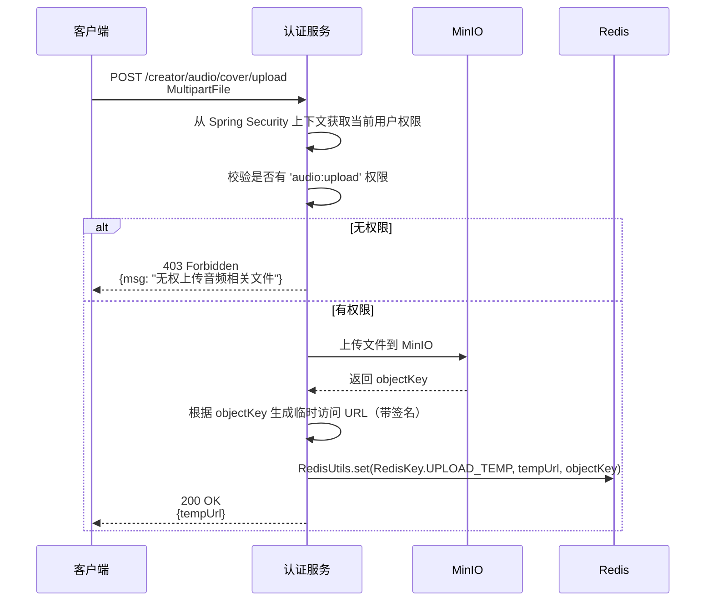
```mermaid
sequenceDiagram
    participant Client as 客户端
    participant Auth as 认证服务
    participant Minio as MinIO
    participant Redis as Redis

    Client->>Auth: POST /creator/audio/cover/upload<br/>MultipartFile
    Auth->>Auth: 从 Spring Security 上下文获取当前用户权限
    Auth->>Auth: 校验是否有 'audio:upload' 权限
    alt 无权限
        Auth-->>Client: 403 Forbidden<br/>{msg: "无权上传音频相关文件"}
    else 有权限
        Auth->>Minio: 上传文件到 MinIO
        Minio-->>Auth: 返回 objectKey
        Auth->>Auth: 根据 objectKey 生成临时访问 URL（带签名）
        Auth->>Redis: RedisUtils.set(RedisKey.UPLOAD_TEMP, tempUrl, objectKey)
        Auth-->>Client: 200 OK<br/>{tempUrl}
    end
```

### 发布音频

```json
// AudioDTO：音频稿件信息
{
	"title": "Spring Boot 核心原理解析",           // 标题（必填）
	"coverUrl": "https://minio.domain.com/...",   // 封面临时URL（必填）
	"description": "深入讲解...",                  // 简介（可选）
	"audioUrl": "https://minio.domain.com/...",   // 音频临时URL（必填）
	
	// 试听设置
	"trialDuration": 30,                    // 试听时长（秒），0表示无试听
	"isPaid": true,                         // 是否收费
	"price": 19.90,                         // 价格（元），isPaid=true时必填
	
	// 稿件设置
	"visibility": "PUBLIC"                  // PUBLIC / PRIVATE
}
```

```json
// AudioPublishVO 出参
{
  "audioId": 1024,
  "status": "PENDING_TRANSCODE"   // PENDING_TRANSCODE / TRANSCODING / ONLINE / FAILED
}
```

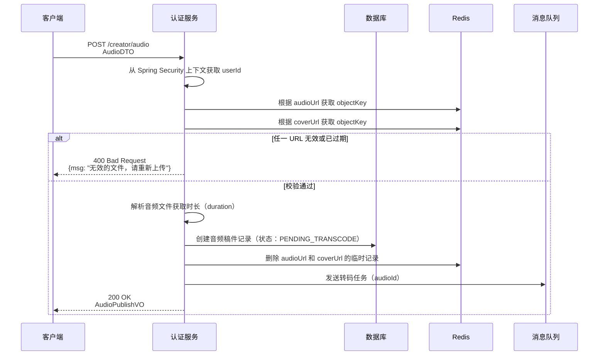
```mermaid
sequenceDiagram
    participant Client as 客户端
    participant Auth as 认证服务
    participant DB as 数据库
    participant Redis as Redis
    participant Queue as 消息队列

    Client->>Auth: POST /creator/audio<br/>AudioDTO
    Auth->>Auth: 从 Spring Security 上下文获取 userId
    Auth->>Redis: 根据 audioUrl 获取 objectKey
    Auth->>Redis: 根据 coverUrl 获取 objectKey
    alt 任一 URL 无效或已过期
        Auth-->>Client: 400 Bad Request<br/>{msg: "无效的文件，请重新上传"}
    else 校验通过
        Auth->>Auth: 解析音频文件获取时长（duration）
        Auth->>DB: 创建音频稿件记录（状态：PENDING_TRANSCODE）
        Auth->>Redis: 删除 audioUrl 和 coverUrl 的临时记录
        Auth->>Queue: 发送转码任务（audioId）
        Auth-->>Client: 200 OK<br/>AudioPublishVO
    end
```

异步转码有更复杂的逻辑，涉及稿件的状态转换：

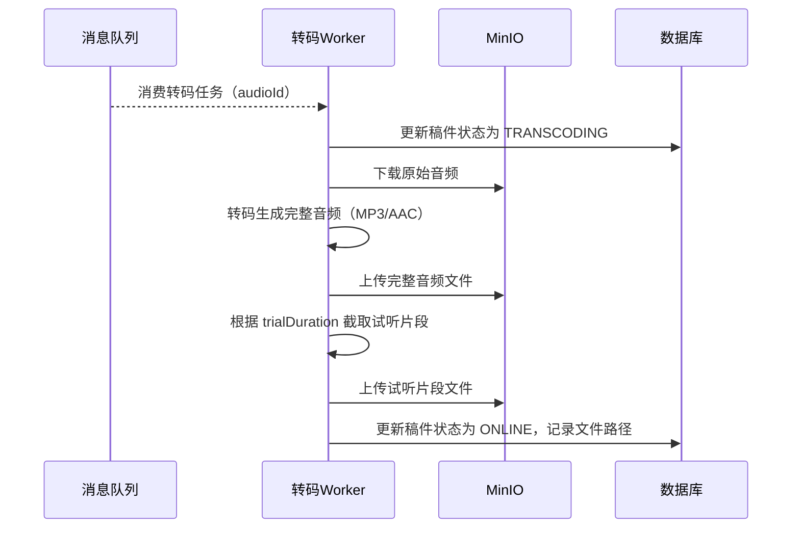
```mermaid
sequenceDiagram
    participant Queue as 消息队列
    participant Worker as 转码Worker
    participant Minio as MinIO
    participant DB as 数据库

    Queue-->>Worker: 消费转码任务（audioId）
    Worker->>DB: 更新稿件状态为 TRANSCODING
    Worker->>Minio: 下载原始音频
    Worker->>Worker: 转码生成完整音频（MP3/AAC）
    Worker->>Minio: 上传完整音频文件
    Worker->>Worker: 根据 trialDuration 截取试听片段
    Worker->>Minio: 上传试听片段文件
    Worker->>DB: 更新稿件状态为 ONLINE，记录文件路径
```

## 稿件管理

前缀为 `/creator`：

| 业务动作     | Controller 方法  | 路径                 | 方法   | 入参             | 出参类                  | 状态 |
| ------------ | ---------------- | -------------------- | ------ | ---------------- | ----------------------- | ---- |
| 我的稿件分页 | `getAudioPage`   | `/audio/page`        | GET    | `PageQuery`      | `IPage<CreatorAudioVO>` |      |
| 获取稿件详情 | `getAudio`       | `/audio/{id}`        | GET    | 路径参数 `id`    | `CreatorAudioDetailVO`  |      |
| 查询稿件状态 | `getAudioStatus` | `/audio/{id}/status` | GET    | 路径参数 `id`    | `AudioStatusVO`         |      |
| 修改音频配置 | `updateAudio`    | `/audio`             | PUT    | `AudioUpdateDTO` | `Void`                  |      |
| 删除稿件     | `removeAudio`    | `/audio/{id}`        | DELETE | 路径参数 `id`    | `Void`                  |      |

### 我的稿件分页

```json
// CreatorAudioVO
 {
      "id": 1024,
      "title": "Spring Boot 核心原理解析",
      "coverUrl": "https://...",
      "duration": 3600,
      "price": 19.90,
      "isPaid": true,
      "visibility": "PUBLIC",
      "status": "PENDING",           // PENDING / APPROVED / REJECTED
      "playCount": 1205,             // 播放量
      "createTime": 1711425600000
    }
```

> 注意：由于[删除稿件](#删除稿件)使用的是逻辑删除，这里获取是要判断逻辑删除的字段，而不是全部返回。

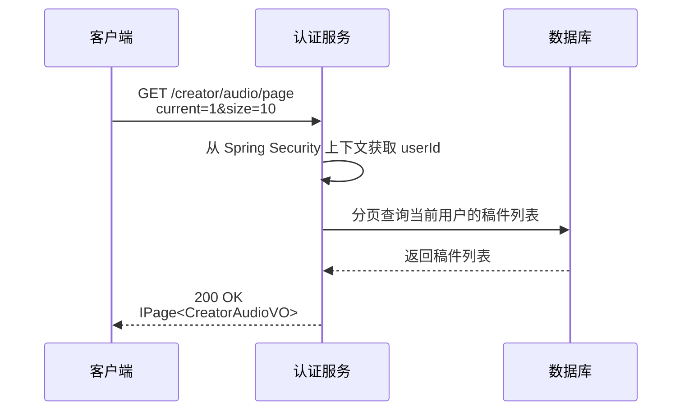
```mermaid
sequenceDiagram
    participant Client as 客户端
    participant Auth as 认证服务
    participant DB as 数据库

    Client->>Auth: GET /creator/audio/page<br/>current=1&size=10
    Auth->>Auth: 从 Spring Security 上下文获取 userId
    Auth->>DB: 分页查询当前用户的稿件列表
    DB-->>Auth: 返回稿件列表
    Auth-->>Client: 200 OK<br/>IPage<CreatorAudioVO>
```


### 获取稿件详情

```json
// CreatorAudioDetailVO 出参
{
  "id": 1024,
  "title": "Spring Boot 核心原理解析",
  "coverUrl": "https://...",
  "description": "深入讲解Spring Boot自动配置原理",
  "duration": 3600,
  "price": 19.90,
  "isPaid": true,
  "trialDuration": 30,
  "visibility": "PUBLIC",
  "status": "APPROVED",
  "playCount": 1205,
  "likeCount": 890,
  "collectCount": 340,
  "createTime": 1711425600000,
  "transcript": {
    "taskId": "task_991",
    "status": 1,                    // 0-未开始 1-进行中 2-已完成 3-失败
    "segments": [
      { "startTime": 0, "endTime": 120, "text": "欢迎大家..." }
    ]
  }
}
```

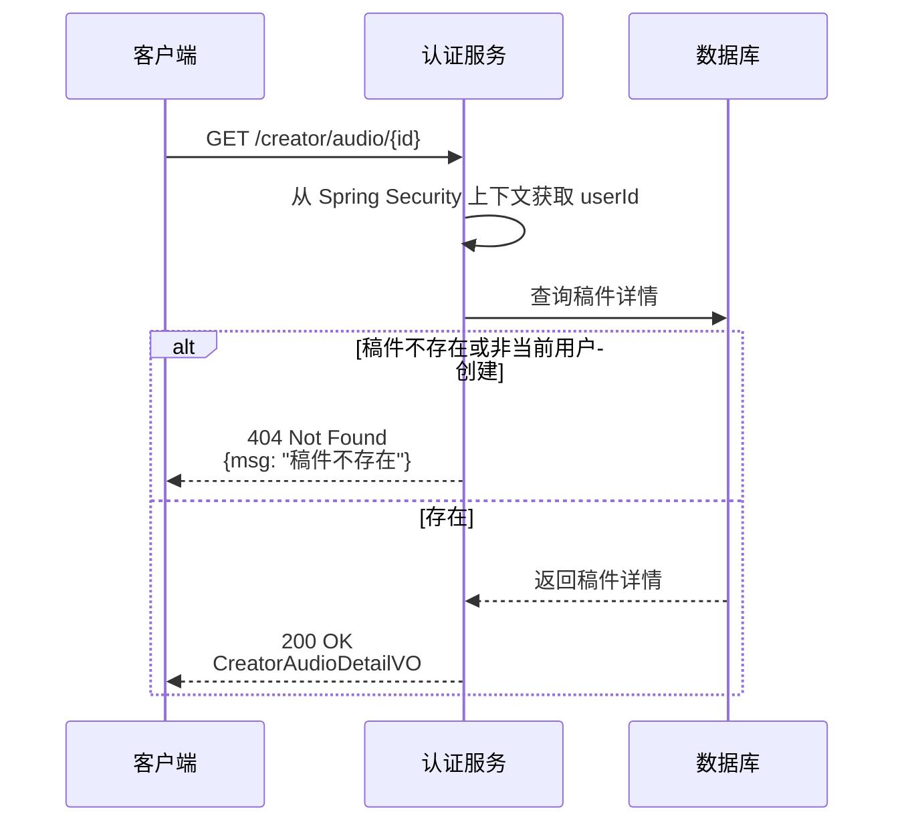
```mermaid
sequenceDiagram
    participant Client as 客户端
    participant Auth as 认证服务
    participant DB as 数据库

    Client->>Auth: GET /creator/audio/{id}
    Auth->>Auth: 从 Spring Security 上下文获取 userId
    Auth->>DB: 查询稿件详情
    alt 稿件不存在或非当前用户创建
        Auth-->>Client: 404 Not Found<br/>{msg: "稿件不存在"}
    else 存在
        DB-->>Auth: 返回稿件详情
        Auth-->>Client: 200 OK<br/>CreatorAudioDetailVO
    end
```

### 查询稿件状态

```json
// AudioStatusVO 出参
{
  "audioId": 1024,
  "status": "ONLINE",        // PENDING_TRANSCODE / TRANSCODING / ONLINE / FAILED
  "failReason": null         // 仅 FAILED 时有值
}
```

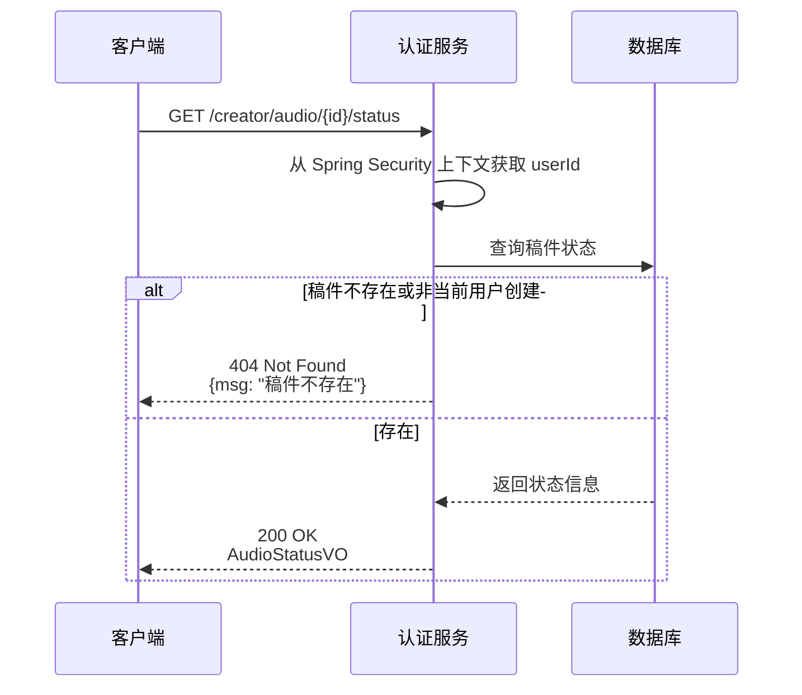
```mermaid
sequenceDiagram
    participant Client as 客户端
    participant Auth as 认证服务
    participant DB as 数据库

    Client->>Auth: GET /creator/audio/{id}/status
    Auth->>Auth: 从 Spring Security 上下文获取 userId
    Auth->>DB: 查询稿件状态
    alt 稿件不存在或非当前用户创建
        Auth-->>Client: 404 Not Found<br/>{msg: "稿件不存在"}
    else 存在
        DB-->>Auth: 返回状态信息
        Auth-->>Client: 200 OK<br/>AudioStatusVO
    end
```

### 修改音频配置

```json
// AudioUpdateDTO：修改音频配置
{
  "id": 1024,                               // 稿件ID（必填）
  "title": "新标题",                         // 标题（可选）
  "coverUrl": "https://minio.domain.com/...", // 封面URL（可选）
  "description": "新简介",                   // 简介（可选）
  "trialDuration": 60,                      // 试听时长（秒，可选）
  "isPaid": true,                           // 是否收费（可选）
  "price": 29.90,                           // 价格（可选）
  "visibility": "PRIVATE"                   // PUBLIC / PRIVATE（可选）
}
```

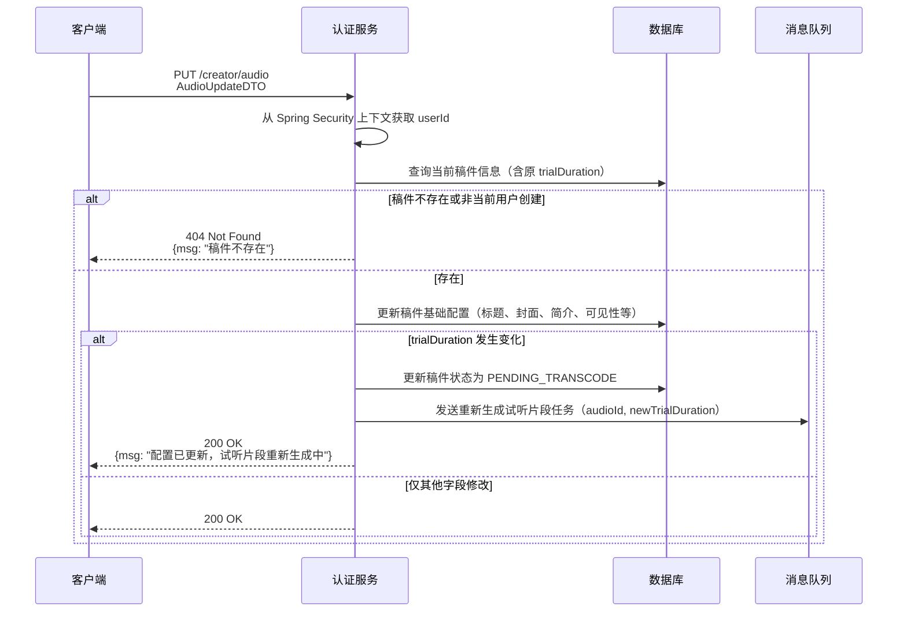
```mermaid
sequenceDiagram
    participant Client as 客户端
    participant Auth as 认证服务
    participant DB as 数据库
    participant Queue as 消息队列

    Client->>Auth: PUT /creator/audio<br/>AudioUpdateDTO
    Auth->>Auth: 从 Spring Security 上下文获取 userId
    Auth->>DB: 查询当前稿件信息（含原 trialDuration）
    alt 稿件不存在或非当前用户创建
        Auth-->>Client: 404 Not Found<br/>{msg: "稿件不存在"}
    else 存在
        Auth->>DB: 更新稿件基础配置（标题、封面、简介、可见性等）
        alt trialDuration 发生变化
            Auth->>DB: 更新稿件状态为 PENDING_TRANSCODE
            Auth->>Queue: 发送重新生成试听片段任务（audioId, newTrialDuration）
            Auth-->>Client: 200 OK<br/>{msg: "配置已更新，试听片段重新生成中"}
        else 仅其他字段修改
            Auth-->>Client: 200 OK
        end
    end
```

### 删除稿件

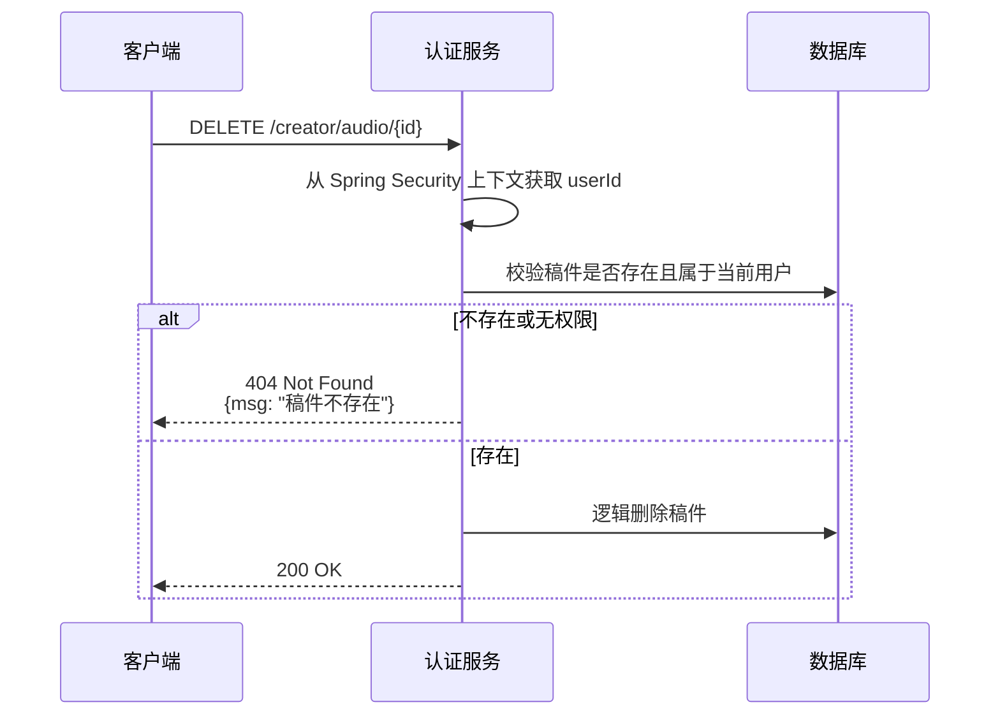
```mermaid
sequenceDiagram
    participant Client as 客户端
    participant Auth as 认证服务
    participant DB as 数据库

    Client->>Auth: DELETE /creator/audio/{id}
    Auth->>Auth: 从 Spring Security 上下文获取 userId
    Auth->>DB: 校验稿件是否存在且属于当前用户
    alt 不存在或无权限
        Auth-->>Client: 404 Not Found<br/>{msg: "稿件不存在"}
    else 存在
        Auth->>DB: 逻辑删除稿件
        Auth-->>Client: 200 OK
    end
```

## 支付功能

本项目以**虚拟币**进行交换，除了现金和虚拟币的对话，其余都是以虚拟币为单位，前缀为 `/user`：

| 业务动作 | Controller 方法  | 路径                 | 方法   | 入参               | 出参类                | 状态  |
| ---- | -------------- | ------------------ | ---- | ---------------- | ------------------ | --- |
| 查询余额 | `getBalance`   | `/balance`         | GET  | 无                | `BalanceVO`        |     |
| 充值   | `recharge`     | `/recharge`        | POST | `RechargeDTO`    | `RechargeResultVO` |     |
| 创建订单 | `saveOrder`    | `/order/{audioId}` | POST | `audioId`        | `OrderVO`          |     |
| 查询订单 | `getOrder`     | `/order/{sn}`      | GET  | 路径参数 `sn`        | `OrderDetailVO`    |     |
| 订单列表 | `getOrderPage` | `/order/page`      | GET  | `OrderPageQuery` | `IPage<OrderVO>`   |     |

### 查询余额

```json
// BalanceVO 出参
{
  "balance": 2801,        // 当前虚拟币余额
  "totalRecharge": 5000,  // 累计充值（可选）
  "totalSpent": 2199      // 累计消费（可选）
}
```

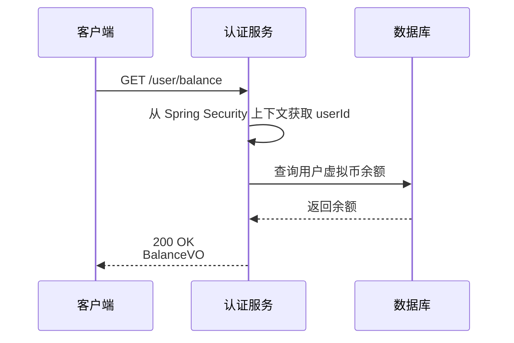
```mermaid
sequenceDiagram
    participant Client as 客户端
    participant Auth as 认证服务
    participant DB as 数据库

    Client->>Auth: GET /user/balance
    Auth->>Auth: 从 Spring Security 上下文获取 userId
    Auth->>DB: 查询用户虚拟币余额
    DB-->>Auth: 返回余额
    Auth-->>Client: 200 OK<br/>BalanceVO
```

### 充值

支付使用支付宝的沙盒测试：

```json
// RechargeDTO：充值请求
{
  "amount": 100,                      // 充值金额（元），必填
  "paymentMethod": "ALIPAY"           // 支付方式：ALIPAY（当前支持），未来可扩展 WECHAT
}
```

```json
// RechargeResultVO：充值结果
{
  "rechargeSn": "RC202603280001",   // 充值订单号
  "payUrl": "https://openapi.alipay.com/gateway.do?..."  // 第三方支付链接
}
```

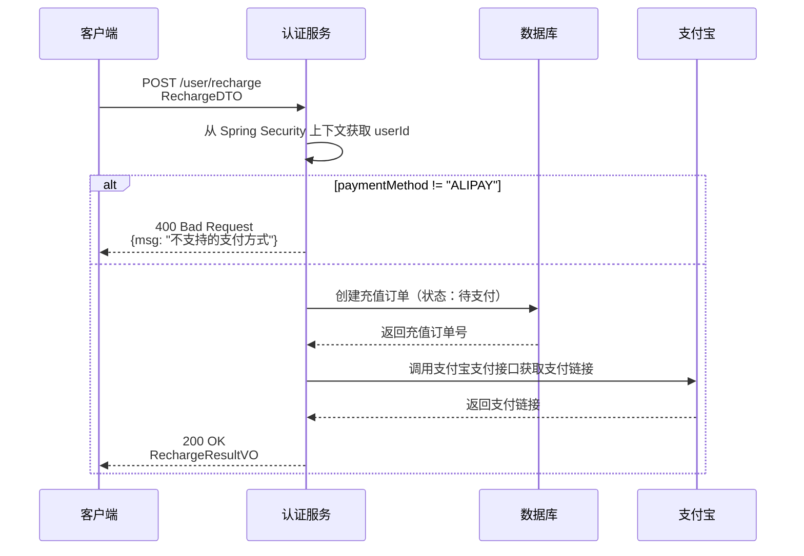
```mermaid
sequenceDiagram
    participant Client as 客户端
    participant Auth as 认证服务
    participant DB as 数据库
    participant Alipay as 支付宝

    Client->>Auth: POST /user/recharge<br/>RechargeDTO
    Auth->>Auth: 从 Spring Security 上下文获取 userId
    alt paymentMethod != "ALIPAY"
        Auth-->>Client: 400 Bad Request<br/>{msg: "不支持的支付方式"}
    else
        Auth->>DB: 创建充值订单（状态：待支付）
        DB-->>Auth: 返回充值订单号
        Auth->>Alipay: 调用支付宝支付接口获取支付链接
        Alipay-->>Auth: 返回支付链接
        Auth-->>Client: 200 OK<br/>RechargeResultVO
    end
```

支付也需要进行异步回调处理，流程如下：

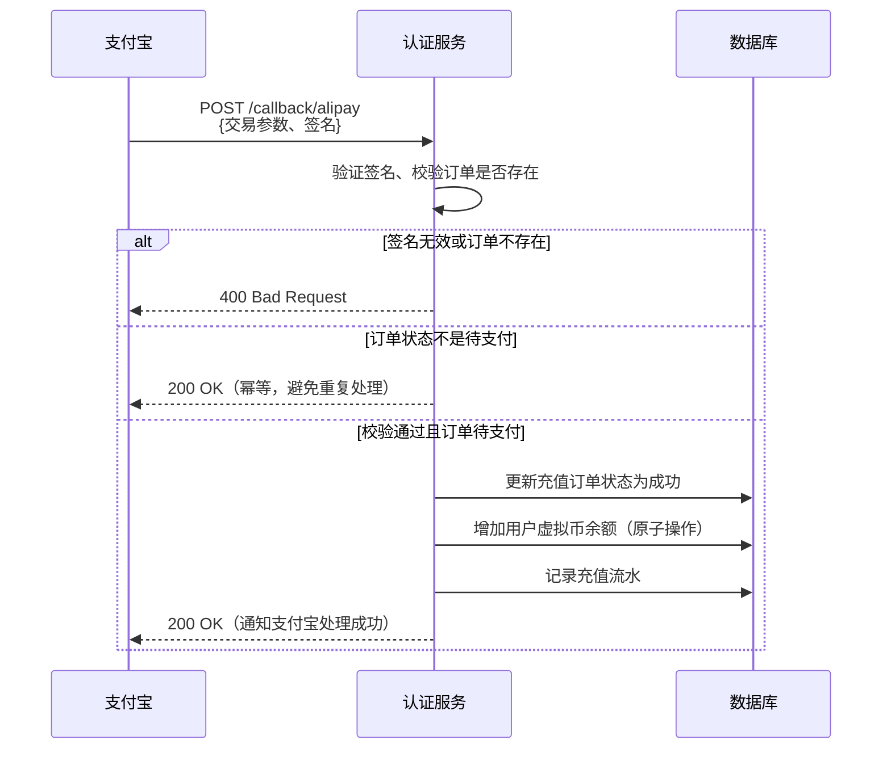
```mermaid
sequenceDiagram
    participant Alipay as 支付宝
    participant Auth as 认证服务
    participant DB as 数据库

    Alipay->>Auth: POST /callback/alipay<br/>{交易参数、签名}
    Auth->>Auth: 验证签名、校验订单是否存在
    alt 签名无效或订单不存在
        Auth-->>Alipay: 400 Bad Request
    else 订单状态不是待支付
        Auth-->>Alipay: 200 OK（幂等，避免重复处理）
    else 校验通过且订单待支付
        Auth->>DB: 更新充值订单状态为成功
        Auth->>DB: 增加用户虚拟币余额（原子操作）
        Auth->>DB: 记录充值流水
        Auth-->>Alipay: 200 OK（通知支付宝处理成功）
    end
```

> 使用 order 表记录，和虚拟币订单共用一个表，使用 orderType 区分。
### 创建订单

用户使用虚拟币购买音频，直接扣减余额并生成订单。处于简单考虑，目前只支持使用虚拟币创建：

```json
// OrderVO 出参
{
  "orderSn": "ORD202603280001",
  "audioId": 1024,
  "payAmount": 199,
  "balanceAfter": 2801,
  "status": "SUCCESS"
}
```

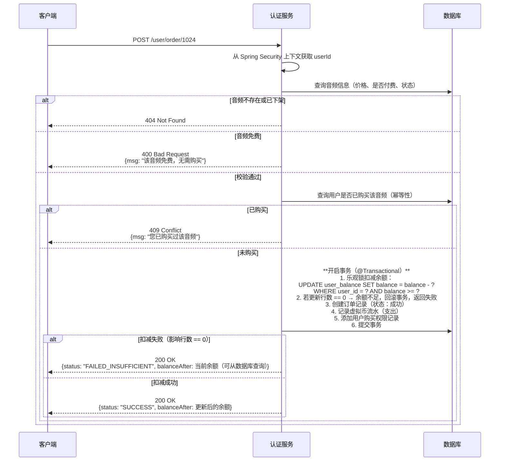
```mermaid
sequenceDiagram
    participant Client as 客户端
    participant Auth as 认证服务
    participant DB as 数据库

    Client->>Auth: POST /user/order/1024
    Auth->>Auth: 从 Spring Security 上下文获取 userId
    Auth->>DB: 查询音频信息（价格、是否付费、状态）
    alt 音频不存在或已下架
        Auth-->>Client: 404 Not Found
    else 音频免费
        Auth-->>Client: 400 Bad Request<br/>{msg: "该音频免费，无需购买"}
    else 校验通过
        Auth->>DB: 查询用户是否已购买该音频（幂等性）
        alt 已购买
            Auth-->>Client: 409 Conflict<br/>{msg: "您已购买过该音频"}
        else 未购买
            Auth->>DB: **开启事务（@Transactional）**<br/>1. 乐观锁扣减余额：<br/>   UPDATE user_balance SET balance = balance - ? <br/>   WHERE user_id = ? AND balance >= ?<br/>2. 若更新行数 == 0 → 余额不足，回滚事务，返回失败<br/>3. 创建订单记录（状态：成功）<br/>4. 记录虚拟币流水（支出）<br/>5. 添加用户购买权限记录<br/>6. 提交事务
            alt 扣减失败（影响行数 == 0）
                Auth-->>Client: 200 OK<br/>{status: "FAILED_INSUFFICIENT", balanceAfter: 当前余额（可从数据库查询）}
            else 扣减成功
                Auth-->>Client: 200 OK<br/>{status: "SUCCESS", balanceAfter: 更新后的余额}
            end
        end
    end
```

### 查询订单

```json
// OrderDetailVO 出参
{
  "orderSn": "ORD202603280001",
  "orderType": "PURCHASE",         // PURCHASE / RECHARGE
  "audioId": 1024,
  "audioTitle": "Spring Boot 核心原理解析",
  "coverUrl": "https://...",
  "payAmount": 199,                // 支付虚拟币数量
  "status": "SUCCESS",             // SUCCESS / FAILED / PENDING（充值订单待支付）
  "createTime": 1711425600000,
  "payTime": 1711425605000
}
```

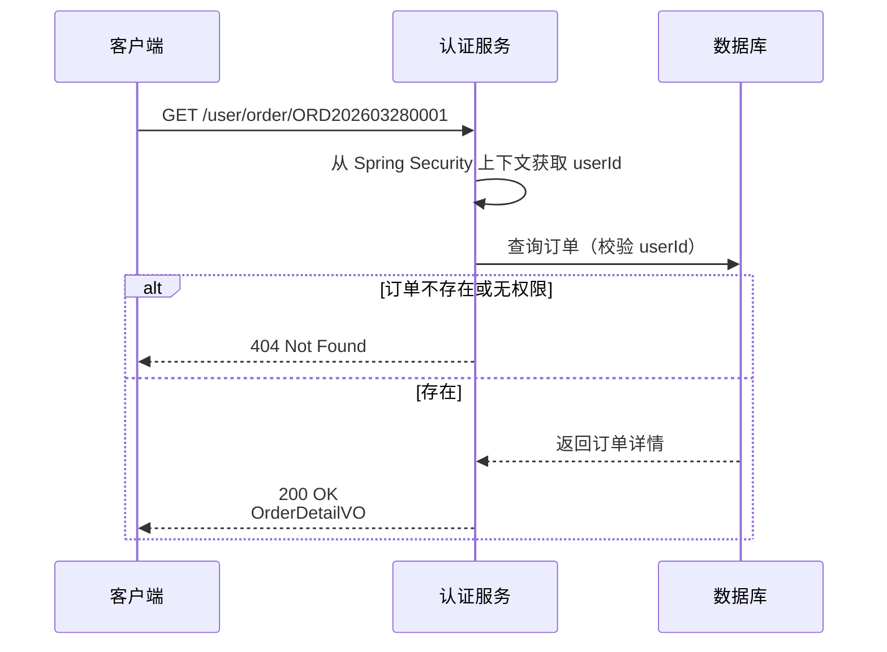
```mermaid
sequenceDiagram
    participant Client as 客户端
    participant Auth as 认证服务
    participant DB as 数据库

    Client->>Auth: GET /user/order/ORD202603280001
    Auth->>Auth: 从 Spring Security 上下文获取 userId
    Auth->>DB: 查询订单（校验 userId）
    alt 订单不存在或无权限
        Auth-->>Client: 404 Not Found
    else 存在
        DB-->>Auth: 返回订单详情
        Auth-->>Client: 200 OK<br/>OrderDetailVO
    end
```

### 订单列表

```json
 { // OrderVO 
	"orderSn": "ORD202603280001",
	"orderType": "PURCHASE",         // PURCHASE / RECHARGE
	"audioId": 1024,
	"audioTitle": "Spring Boot 核心原理解析",
	"coverUrl": "https://...",
	"payAmount": 199,
	"status": "SUCCESS",
	"createTime": 1711425600000
}
```

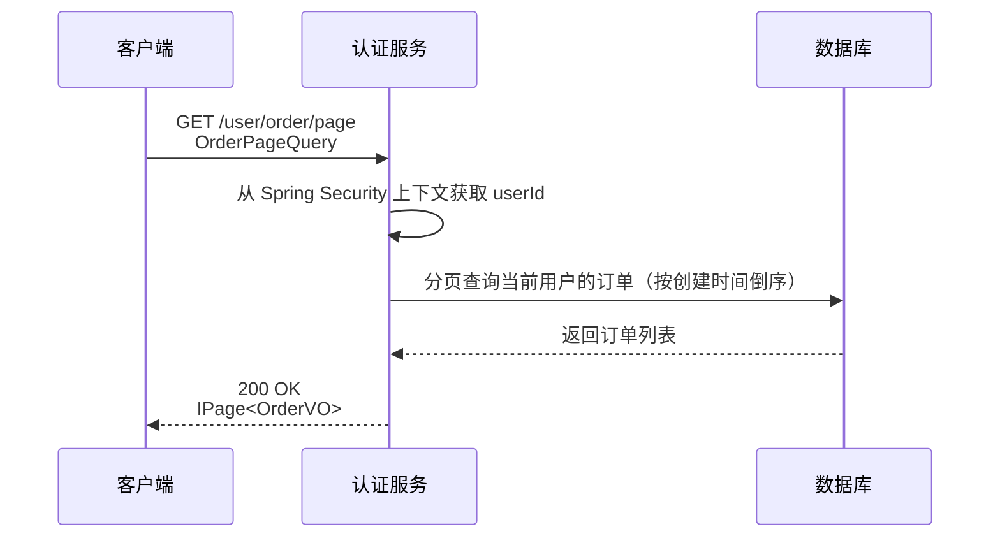
```mermaid
sequenceDiagram
    participant Client as 客户端
    participant Auth as 认证服务
    participant DB as 数据库

    Client->>Auth: GET /user/order/page<br/>OrderPageQuery
    Auth->>Auth: 从 Spring Security 上下文获取 userId
    Auth->>DB: 分页查询当前用户的订单（按创建时间倒序）
    DB-->>Auth: 返回订单列表
    Auth-->>Client: 200 OK<br/>IPage<OrderVO>
```

## 推荐

前缀为 `/user`：

| 业务动作 | Controller 方法    | 路径               | 方法 | 入参        | 出参类           | 状态 |
| -------- | ------------------ | ------------------ | ---- | ----------- | ---------------- | ---- |
| 热榜     | `getHotList`       | `/audio/hot`       | GET  | 无          | `List<AudioVO>`  |      |
| 推荐列表 | `getRecommendList` | `/audio/recommend` | GET  | `PageQuery` | `IPage<AudioVO>` |      |

### 热榜

```json
// AudioVO 出参
{
  "id": 1024,
  "title": "Spring Boot 核心原理解析",
  "coverUrl": "https://...",
  "duration": 3600,
  "creatorName": "后端架构师",
  "playCount": 1205,
  "hotScore": 9850
}
```

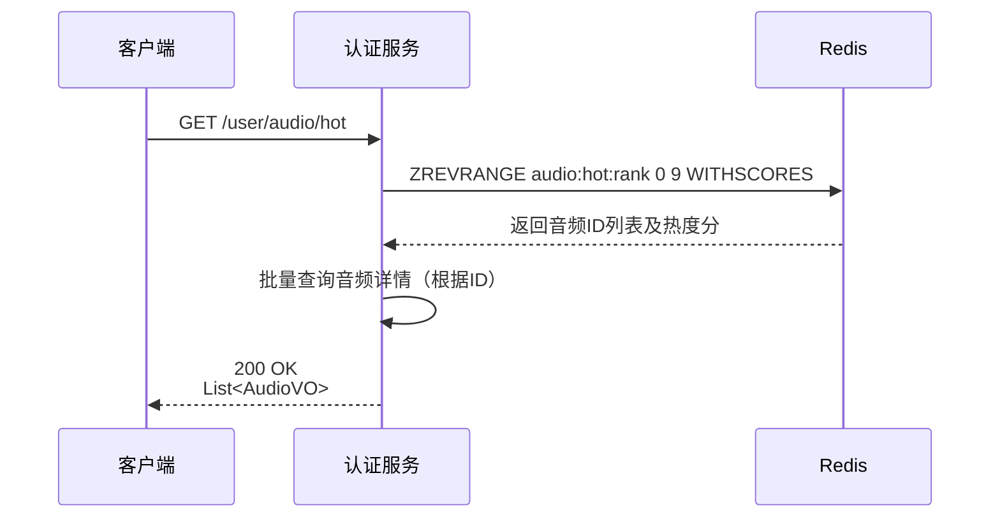
```mermaid
sequenceDiagram
    participant Client as 客户端
    participant Auth as 认证服务
    participant Redis as Redis

    Client->>Auth: GET /user/audio/hot
    Auth->>Redis: ZREVRANGE audio:hot:rank 0 9 WITHSCORES
    Redis-->>Auth: 返回音频ID列表及热度分
    Auth->>Auth: 批量查询音频详情（根据ID）
    Auth-->>Client: 200 OK<br/>List<AudioVO>
```

热度分需要定时计算：

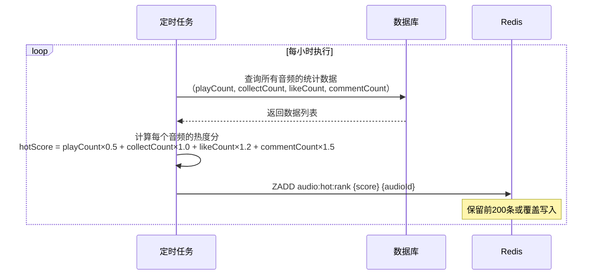
```mermaid
sequenceDiagram
    participant Scheduler as 定时任务
    participant DB as 数据库
    participant Redis as Redis

    loop 每小时执行
        Scheduler->>DB: 查询所有音频的统计数据<br/>（playCount, collectCount, likeCount, commentCount）
        DB-->>Scheduler: 返回数据列表
        Scheduler->>Scheduler: 计算每个音频的热度分<br/>hotScore = playCount×0.5 + collectCount×1.0 + likeCount×1.2 + commentCount×1.5
        Scheduler->>Redis: ZADD audio:hot:rank {score} {audioId}
        Note over Redis: 保留前200条或覆盖写入
    end
```

### 推荐算法

只实现一个非常简易的算法：

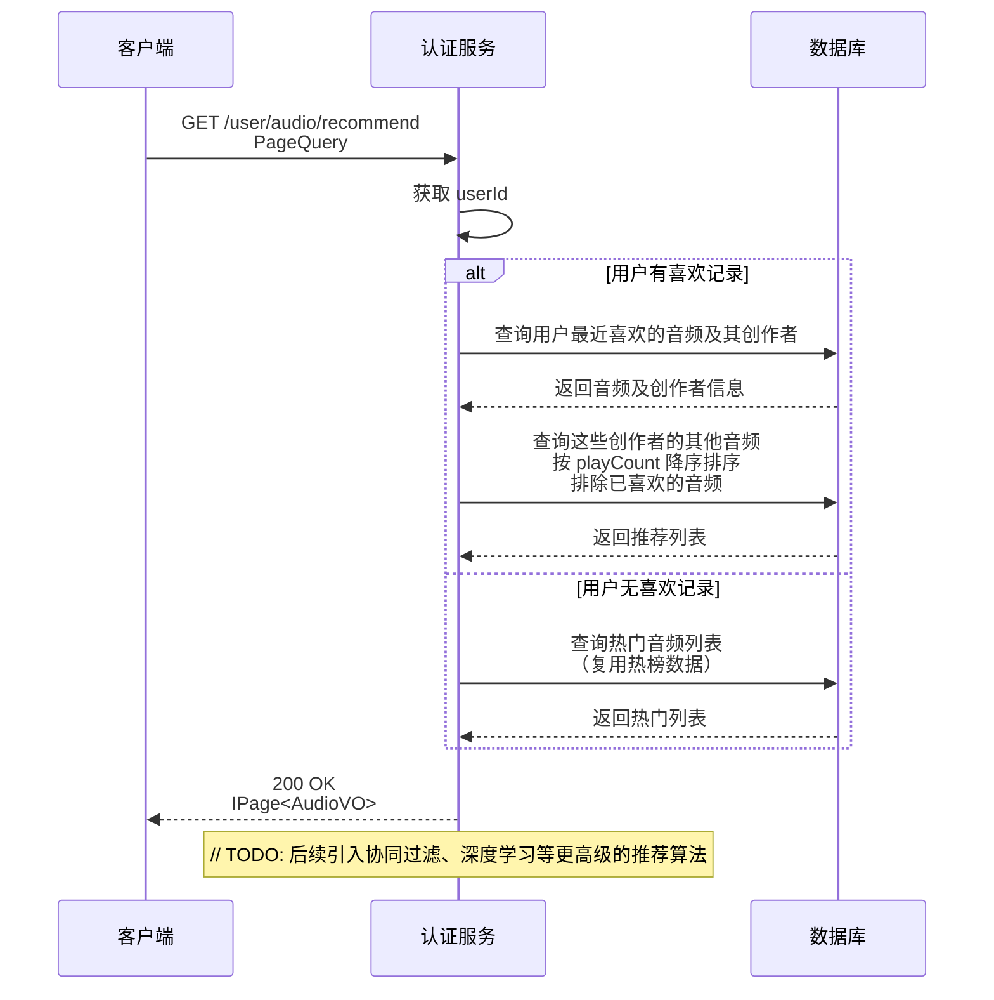
```mermaid
sequenceDiagram
    participant Client as 客户端
    participant Auth as 认证服务
    participant DB as 数据库

    Client->>Auth: GET /user/audio/recommend<br/>PageQuery
    Auth->>Auth: 获取 userId

    alt 用户有喜欢记录
        Auth->>DB: 查询用户最近喜欢的音频及其创作者
        DB-->>Auth: 返回音频及创作者信息
        Auth->>DB: 查询这些创作者的其他音频<br/>按 playCount 降序排序<br/>排除已喜欢的音频
        DB-->>Auth: 返回推荐列表
    else 用户无喜欢记录
        Auth->>DB: 查询热门音频列表<br/>（复用热榜数据）
        DB-->>Auth: 返回热门列表
    end

    Auth-->>Client: 200 OK<br/>IPage<AudioVO>

    Note over Auth: // TODO: 后续引入协同过滤、深度学习等更高级的推荐算法
```

## 管理员

前缀为 `/admin`：

| 业务动作      | Controller 方法     | 路径                        | 方法 | 入参             | 出参类                | 状态 |
| ------------- | ------------------- | --------------------------- | ---- | ---------------- | --------------------- | ---- |
| 待审音频分页  | `getAuditAudioPage` | `/audio/audit/page`         | GET  | `AuditQuery`     | `IPage<AuditAudioVO>` |      |
| 执行音频审核  | `auditAudio`        | `/audio/audit`              | PUT  | `AudioAuditDTO`  | `Void`                |      |
| 封禁/解封用户 | `updateUserStatus`  | `/user/status`              | PUT  | `UserStatusDTO`  | `Void`                |      |
| 待审申请分页  | `getAuditApplyPage` | `/creator/apply/audit/page` | GET  | `AuditQuery`     | `IPage<AuditApplyVO>` |      |
| 执行申请审核  | `auditApply`        | `/creator/apply/audit`      | PUT  | `ApplyAuditDTO`  | `Void`                |      |
| 全站数据大盘  | `getDashboard`      | `/stat/dashboard`           | GET  | `DashboardQuery` | `DashboardVO`         |      |

### 待审音频分页

```json
// AuditQuery：继承 PageQuery
{
  "pageNum": 1,
  "pageSize": 10,
  "status": "PENDING"        // 可选，默认 PENDING，也可查 ALL/APPROVED/REJECTED
}
```

```json
// AuditAudioVO 出参
{
  "id": 1024,
  "title": "Spring Boot 核心原理解析",
  "coverUrl": "https://...",
  "duration": 3600,
  "creatorId": 88,
  "creatorName": "后端架构师",
  "transcript": "音频转写文本内容...",      // 用于辅助审核
  "submitTime": 1711425600000
}
```

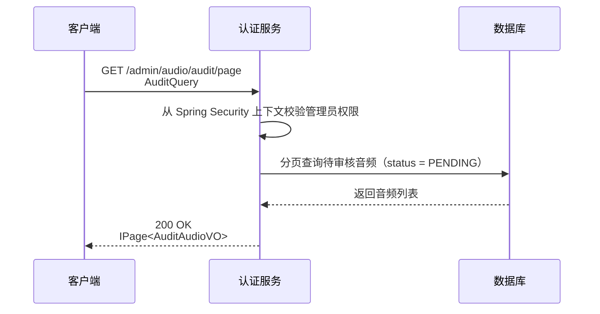
```mermaid
sequenceDiagram
    participant Client as 客户端
    participant Auth as 认证服务
    participant DB as 数据库

    Client->>Auth: GET /admin/audio/audit/page<br/>AuditQuery
    Auth->>Auth: 从 Spring Security 上下文校验管理员权限
    Auth->>DB: 分页查询待审核音频（status = PENDING）
    DB-->>Auth: 返回音频列表
    Auth-->>Client: 200 OK<br/>IPage<AuditAudioVO>
```

### 执行音频审核

```json
// AudioAuditDTO：审核请求
{
  "audioId": 1024,
  "status": "APPROVED",      // APPROVED / REJECTED
  "rejectReason": null       // 驳回时必填
}
```

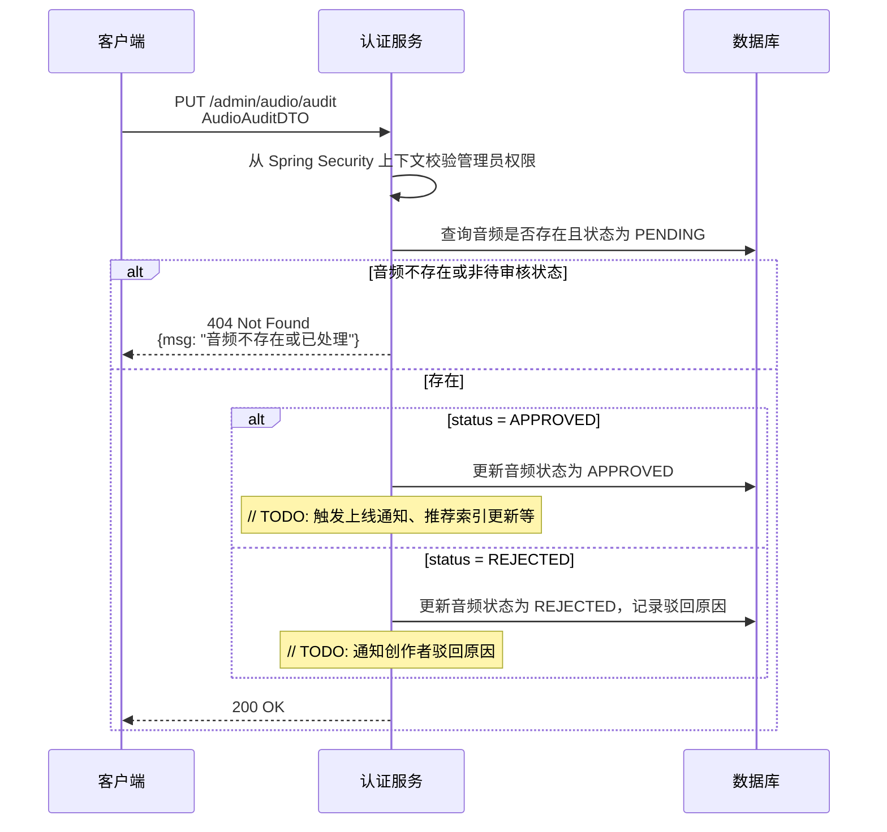
```mermaid
sequenceDiagram
    participant Client as 客户端
    participant Auth as 认证服务
    participant DB as 数据库

    Client->>Auth: PUT /admin/audio/audit<br/>AudioAuditDTO
    Auth->>Auth: 从 Spring Security 上下文校验管理员权限
    Auth->>DB: 查询音频是否存在且状态为 PENDING
    alt 音频不存在或非待审核状态
        Auth-->>Client: 404 Not Found<br/>{msg: "音频不存在或已处理"}
    else 存在
        alt status = APPROVED
            Auth->>DB: 更新音频状态为 APPROVED
            Note over Auth: // TODO: 触发上线通知、推荐索引更新等
        else status = REJECTED
            Auth->>DB: 更新音频状态为 REJECTED，记录驳回原因
            Note over Auth: // TODO: 通知创作者驳回原因
        end
        Auth-->>Client: 200 OK
    end
```

### 封禁/解封用户

```json
// UserStatusDTO：用户状态修改请求
{
  "userId": 1001,
  "action": "BAN"            // BAN / UNBAN
}
```

```mermaid
sequenceDiagram
    participant Client as 客户端
    participant Auth as 认证服务
    participant DB as 数据库

    Client->>Auth: PUT /admin/user/status<br/>UserStatusDTO
    Auth->>Auth: 从 Spring Security 上下文校验管理员权限
    Auth->>DB: 查询用户是否存在
    alt 用户不存在
        Auth-->>Client: 404 Not Found<br/>{msg: "用户不存在"}
    else 存在
        alt action = BAN
            Auth->>DB: 更新用户状态为封禁（status = BANNED）
            Note over Auth: // TODO: 清除该用户的 JWT 缓存，强制下线
        else action = UNBAN
            Auth->>DB: 更新用户状态为正常（status = NORMAL）
        end
        Auth-->>Client: 200 OK
    end
```

### ### 待审申请分页

```json
// AuditQuery：继承 PageQuery
{
  "pageNum": 1,
  "pageSize": 10,
  "status": "PENDING"        // 可选，默认 PENDING
}
```

```json
// AuditApplyVO 出参
{
  "applyId": 1,
  "userId": 1001,
  "username": "听众_8848",
  "realName": "张三",
  "phone": "13800000000",
  "intro": "资深后端工程师，擅长技术分享",
  "attachment": "https://...",
  "applyTime": 1711425600000
}
```

```mermaid
sequenceDiagram
    participant Client as 客户端
    participant Auth as 认证服务
    participant DB as 数据库

    Client->>Auth: GET /admin/creator/apply/audit/page<br/>AuditQuery
    Auth->>Auth: 从 Spring Security 上下文校验管理员权限
    Auth->>DB: 分页查询待审核申请（status = PENDING）
    DB-->>Auth: 返回申请列表
    Auth-->>Client: 200 OK<br/>IPage<AuditApplyVO>
```

### 执行申请审核

```json
// ApplyAuditDTO：审核请求
{
  "applyId": 1,
  "status": "APPROVED",      // APPROVED / REJECTED
  "rejectReason": null       // 驳回时必填
}
```

```mermaid
sequenceDiagram
    participant Client as 客户端
    participant Auth as 认证服务
    participant DB as 数据库

    Client->>Auth: PUT /admin/creator/apply/audit<br/>ApplyAuditDTO
    Auth->>Auth: 从 Spring Security 上下文校验管理员权限
    Auth->>DB: 查询申请是否存在且状态为 PENDING
    alt 申请不存在或已处理
        Auth-->>Client: 404 Not Found<br/>{msg: "申请不存在或已处理"}
    else 存在
        alt status = APPROVED
            Auth->>DB: 更新申请状态为 APPROVED
            Auth->>DB: 更新用户角色为 CREATOR
            Note over Auth: // TODO: 通知用户审核通过
        else status = REJECTED
            Auth->>DB: 更新申请状态为 REJECTED，记录驳回原因
            Note over Auth: // TODO: 通知用户驳回原因
        end
        Auth-->>Client: 200 OK
    end
```

### 全站数据大盘

> 要聚合的表很多，目前暂时不敲定

```json
// DashboardQuery：时间范围筛选
{
  "startDate": "2026-03-01",   // 可选，默认近7天
  "endDate": "2026-03-28"      // 可选，默认今天
}
```

```json
// DashboardVO 出参
{
  "totalSales": 285000.00,           // 总销售额（元）
  "todaySales": 1500.00,             // 今日销售额
  "activeUsers": 12000,              // DAU
  "totalUsers": 50000,               // 累计用户数
  "monthlyActiveUsers": 25000,       // MAU
  "conversionRate": 0.085,           // 付费转化率（付费用户数 / DAU）
  "salesTrend": [                    // 销售额趋势
    { "date": "2026-03-20", "amount": 1200 },
    { "date": "2026-03-21", "amount": 1800 }
  ],
  "hotAudioList": [                  // 热门音频排行
    { "id": 1024, "title": "Spring Boot 核心原理解析", "playCount": 1205 },
    { "id": 1025, "title": "Redis 深度解析", "playCount": 980 }
  ],
  "creatorEarnings": [               // 创作者收益趋势
    { "creatorName": "后端架构师", "amount": 5000 },
    { "creatorName": "数据库专家", "amount": 3200 }
  ]
}
```

## AI 增强

前缀为 `/creator`（申请任务）和 `/common`（查询任务状态）：

|业务动作|Controller 方法|路径|方法|入参|出参类|状态|
|---|---|---|---|---|---|---|
|申请 AI 转写|`saveAiTranscript`|`/ai/transcript`|POST|`AudioIdDTO`|`AiTaskVO`||
|申请 AI 摘要|`saveAiNote`|`/ai/note`|POST|`AudioIdDTO`|`AiTaskVO`||
|查询 AI 任务状态|`getAiTask`|`/ai/task/{taskId}`|GET|路径参数 `taskId`|`AiTaskVO`|

### 请 AI 转写

```json
// AiTaskVO 出参
{
  "taskId": "task_991",
  "status": "PENDING"        // PENDING / PROCESSING / SUCCESS / FAILED
}
```

```mermaid
sequenceDiagram
    participant Client as 客户端
    participant Auth as 认证服务
    participant DB as 数据库
    participant Queue as 消息队列

    Client->>Auth: POST /creator/ai/transcript<br/>AudioIdDTO
    Auth->>Auth: 从 Spring Security 上下文获取 userId
    Auth->>DB: 校验音频是否存在且属于当前用户
    alt 音频不存在或无权限
        Auth-->>Client: 404 Not Found
    else 存在
        Auth->>DB: 创建 AI 任务记录（状态：PENDING）
        DB-->>Auth: 返回 taskId
        Auth->>Queue: 发送转写任务（taskId, audioId）
        Auth-->>Client: 200 OK<br/>AiTaskVO
    end
```

异步调用如下：

```mermaid
sequenceDiagram
    participant Queue as 消息队列
    participant Worker as 转写Worker
    participant Minio as MinIO
    participant AI as AI服务
    participant DB as 数据库

    Queue-->>Worker: 消费转写任务（taskId, audioId）
    Worker->>DB: 更新任务状态为 PROCESSING
    Worker->>Minio: 下载音频文件
    Minio-->>Worker: 返回音频数据
    Worker->>AI: 调用语音转写接口
    AI-->>Worker: 返回转写结果（segments）
    alt 调用成功
        Worker->>DB: 更新任务状态为 SUCCESS，保存转写结果
    else 调用失败
        Worker->>DB: 更新任务状态为 FAILED，记录失败原因
    end
```

### 查询 AI 任务状态

```json
// AiTaskVO 出参（转写任务）
{
  "taskId": "task_991",
  "type": "TRANSCRIPT",      // TRANSCRIPT / NOTE
  "status": "SUCCESS",       // PENDING / PROCESSING / SUCCESS / FAILED
  "result": {
    "segments": [
      { "startTime": 0, "endTime": 120, "text": "欢迎大家..." }
    ]
  },
  "failReason": null
}
```