专门处理作为核心业务的咨询系统。

## 时间槽管理

前缀都为 `/creator`：

| 业务动作       | Controller 方法 | 路径          | 方法 | 入参                     | 出参类          | 状态 |
| -------------- | --------------- | ------------- | ---- | ------------------------ | --------------- | ---- |
| 批量生成时间槽 | `saveSlotBatch` | `/slots`      | POST | `List<SlotDTO>`          | `Void`          |      |
| 分页查询时间槽 | `getSlotPage`   | `/slots/page` | GET  | `SlotPageQuery`          | `IPage<SlotVO>` |      |
| 修改时间槽状态 | `updateSlot`    | `/slots/{id}` | PUT  | `路径参数 id` + `status` | `Void`          |      |

### 批量生成时间槽

```json
// SlotDTO：单个时间槽
{
  "startTime": "2026-04-01 10:00:00",     // 开始时间（必填）
  "endTime": "2026-04-01 11:00:00",       // 结束时间（必填）
  "price": 50,                            // 预约价格（虚拟币，必填）
  "address": "腾讯会议链接xxx"             // 预约地址（必填）
}
```

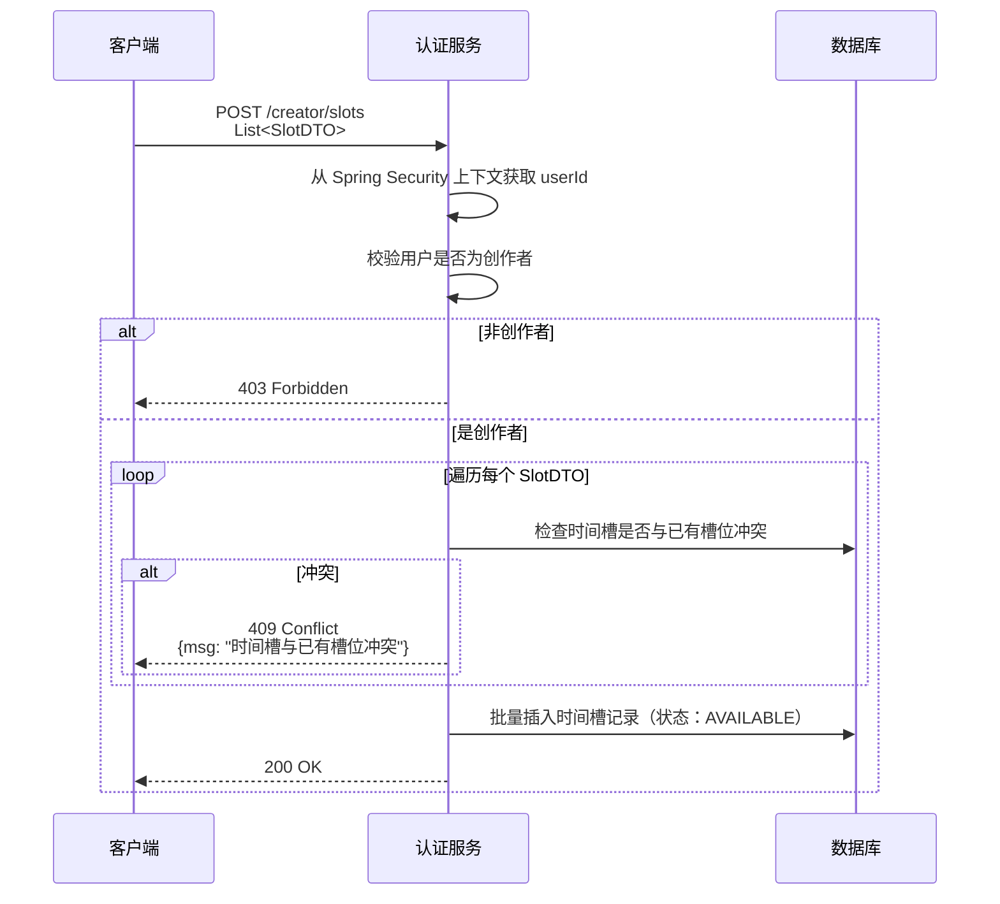
```mermaid
sequenceDiagram
    participant Client as 客户端
    participant Auth as 认证服务
    participant DB as 数据库

    Client->>Auth: POST /creator/slots<br/>List<SlotDTO>
    Auth->>Auth: 从 Spring Security 上下文获取 userId
    Auth->>Auth: 校验用户是否为创作者
    alt 非创作者
        Auth-->>Client: 403 Forbidden
    else 是创作者
        loop 遍历每个 SlotDTO
            Auth->>DB: 检查时间槽是否与已有槽位冲突
            alt 冲突
                Auth-->>Client: 409 Conflict<br/>{msg: "时间槽与已有槽位冲突"}
            end
        end
        Auth->>DB: 批量插入时间槽记录（状态：AVAILABLE）
        Auth-->>Client: 200 OK
    end
```

### 分页查询时间槽

```json
// SlotPageQuery：继承 PageQuery
{
  "startTime": "2026-04-01 00:00:00",     // 可选，开始时间范围
  "endTime": "2026-04-30 23:59:59",       // 可选，结束时间范围
  "pageNum": 1,
  "pageSize": 10
}
```

```json
// SlotVO 出参
{
  "id": 1,
  "startTime": "2026-04-01 10:00:00",
  "endTime": "2026-04-01 11:00:00",
  "price": 50,
  "address": "腾讯会议链接xxx",
  "status": "AVAILABLE",                  // AVAILABLE / BOOKED / EXPIRED / CANCELLED
}
```

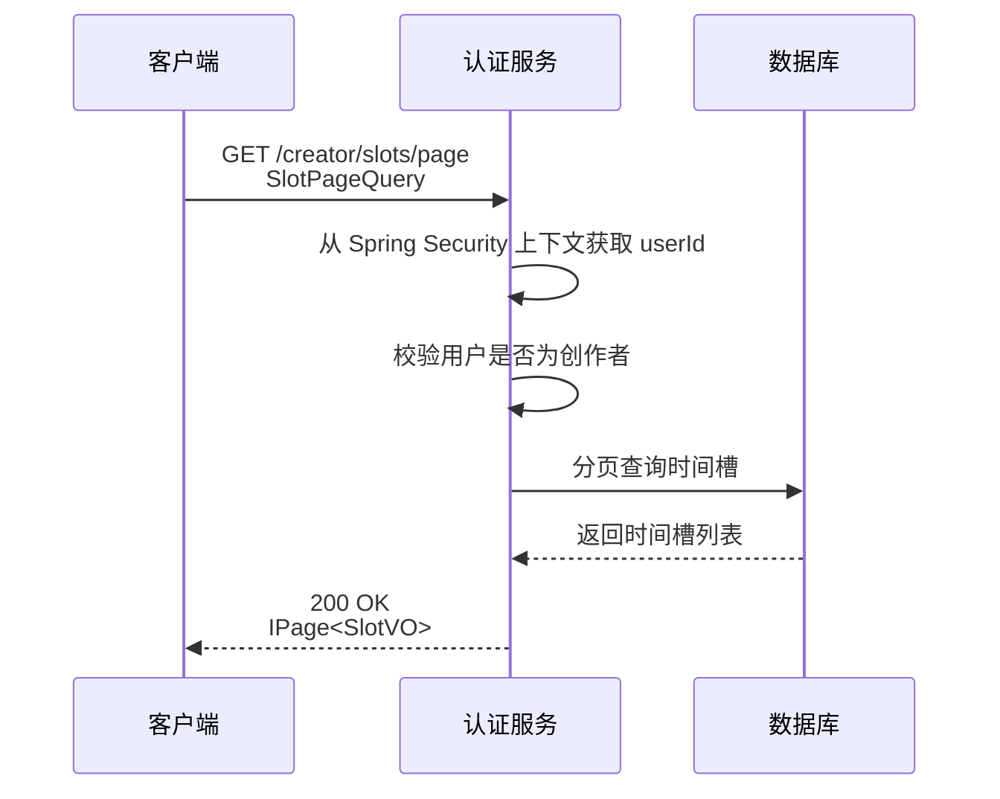
```mermaid
sequenceDiagram
    participant Client as 客户端
    participant Auth as 认证服务
    participant DB as 数据库

    Client->>Auth: GET /creator/slots/page<br/>SlotPageQuery
    Auth->>Auth: 从 Spring Security 上下文获取 userId
    Auth->>Auth: 校验用户是否为创作者
    Auth->>DB: 分页查询时间槽
    DB-->>Auth: 返回时间槽列表
    Auth-->>Client: 200 OK<br/>IPage<SlotVO>
```

### 修改时间槽状态

  `status` 有 `CANCELLED` / `AVAILABLE`（关闭或开启）

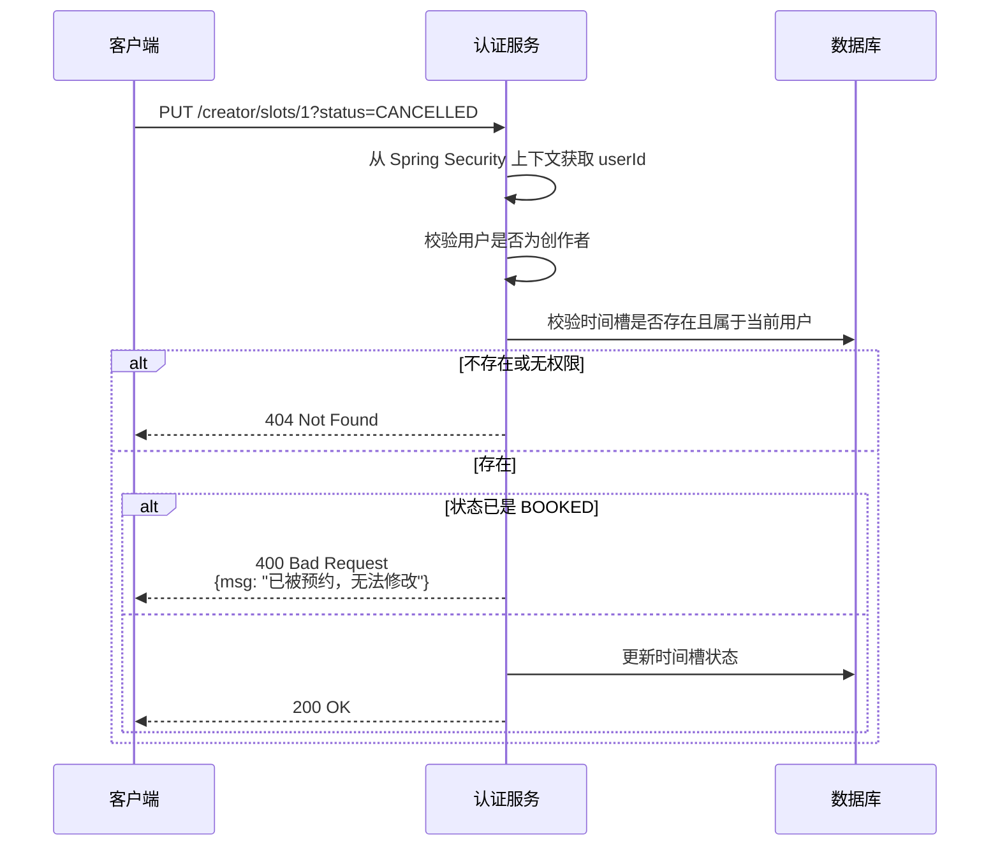
```mermaid
sequenceDiagram
    participant Client as 客户端
    participant Auth as 认证服务
    participant DB as 数据库

    Client->>Auth: PUT /creator/slots/1?status=CANCELLED
    Auth->>Auth: 从 Spring Security 上下文获取 userId
    Auth->>Auth: 校验用户是否为创作者
    Auth->>DB: 校验时间槽是否存在且属于当前用户
    alt 不存在或无权限
        Auth-->>Client: 404 Not Found
    else 存在
        alt 状态已是 BOOKED
            Auth-->>Client: 400 Bad Request<br/>{msg: "已被预约，无法修改"}
        else
            Auth->>DB: 更新时间槽状态
            Auth-->>Client: 200 OK
        end
    end
```

## 订单状态图

前排提醒，后面将涉及用户、创作者和管理员的操作，还要考虑退款情况，订单状态将很复杂，需要先看看下面状态图：

> 为了简化，这里不支持第三方支付，而是虚拟币直接扣除。

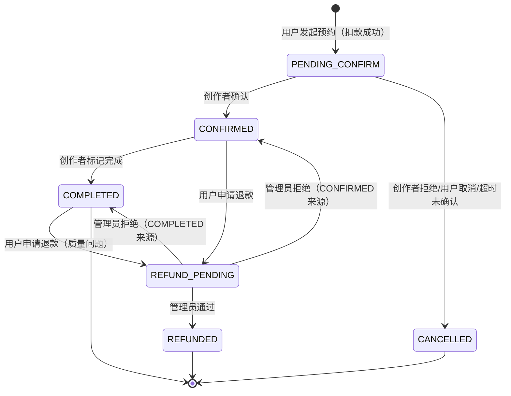
```mermaid
stateDiagram-v2
    [*] --> PENDING_CONFIRM: 用户发起预约（扣款成功）
    
    PENDING_CONFIRM --> CONFIRMED: 创作者确认
    PENDING_CONFIRM --> CANCELLED: 创作者拒绝/用户取消/超时未确认
    
    CONFIRMED --> COMPLETED: 创作者标记完成
    CONFIRMED --> REFUND_PENDING: 用户申请退款
    
    COMPLETED --> REFUND_PENDING: 用户申请退款（质量问题）
    
    REFUND_PENDING --> REFUNDED: 管理员通过
    REFUND_PENDING --> CONFIRMED: 管理员拒绝（CONFIRMED 来源）
    REFUND_PENDING --> COMPLETED: 管理员拒绝（COMPLETED 来源）
    
    COMPLETED --> [*]
    CANCELLED --> [*]
    REFUNDED --> [*]
```

退款情况：

| 场景         | 订单状态          | 触发条件                       | 退款方式                               |
| ------------ | ----------------- | ------------------------------ | -------------------------------------- |
| 用户主动取消 | `PENDING_CONFIRM` | 用户点击取消                   | 全额自动退款                           |
| 创作者拒绝   | `PENDING_CONFIRM` | 创作者点击拒绝                 | 全额自动退款                           |
| 超时未确认   | `PENDING_CONFIRM` | 创作者48小时内未确认           | 全额自动退款                           |
| 超时未完成   | `CONFIRMED`       | 预约时间已过但创作者未标记完成 | 用户可申请退款，或系统自动发起退款申请 |
| 用户申请退款 | `CONFIRMED`       | 用户发起申请                   | 管理员审核                             |
| 咨询质量问题 | `COMPLETED`       | 特殊情况                       | 管理员审核                             |

也不用一直惦记，后面时序图会说明什么时候退款的，不过要能看懂代码。

## 预约订单管理

创作者查看和处理用户的预约订单。前缀为 `/creator`：

| 业务动作         | Controller 方法   | 路径                     | 方法 | 入参                              | 出参类                  | 状态 |
| ---------------- | ----------------- | ------------------------ | ---- | --------------------------------- | ----------------------- | ---- |
| 分页查询预约订单 | `getConsultPage`  | `/consult/page`          | GET  | `ConsultPageQuery`                | `IPage<ConsultOrderVO>` |      |
| 确认预约         | `confirmConsult`  | `/consult/{id}/confirm`  | PUT  | 路径参数 `id` + `address`（可选） | `Void`                  |      |
| 拒绝预约         | `rejectConsult`   | `/consult/{id}/reject`   | PUT  | 路径参数 `id`                     | `Void`                  |      |
| 标记完成         | `completeConsult` | `/consult/{id}/complete` | PUT  | 路径参数 `id`                     | `Void`                  |      |

### 分页查询预约订单

```json
// ConsultPageQuery：继承 PageQuery
{
  "status": "PENDING_CONFIRM",     // 见前面状态图
  "startDate": "2026-04-01",       // 可选
  "endDate": "2026-04-30",         // 可选
  "pageNum": 1,
  "pageSize": 10
}
```

```json
// ConsultOrderVO 出参
{
  "id": 1,
  "slotId": 1,
  "date": "2026-04-01",
  "startTime": "10:00",
  "endTime": "11:00",
  "price": 50,
  "status": "PENDING_CONFIRM",
  "address": "腾讯会议链接xxx",     // 始终返回 slot 中的地址，确认时可修改
  "userId": 1001,
  "userNickname": "听众_8848",
  "userAvatar": "https://...",
  "message": "想咨询一下技术问题",
  "createTime": 1711425600000
}
```

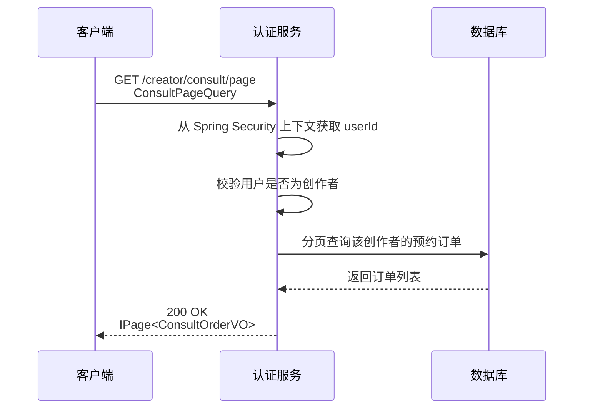
```mermaid
sequenceDiagram
    participant Client as 客户端
    participant Auth as 认证服务
    participant DB as 数据库

    Client->>Auth: GET /creator/consult/page<br/>ConsultPageQuery
    Auth->>Auth: 从 Spring Security 上下文获取 userId
    Auth->>Auth: 校验用户是否为创作者
    Auth->>DB: 分页查询该创作者的预约订单
    DB-->>Auth: 返回订单列表
    Auth-->>Client: 200 OK<br/>IPage<ConsultOrderVO>
```

### 确认预约

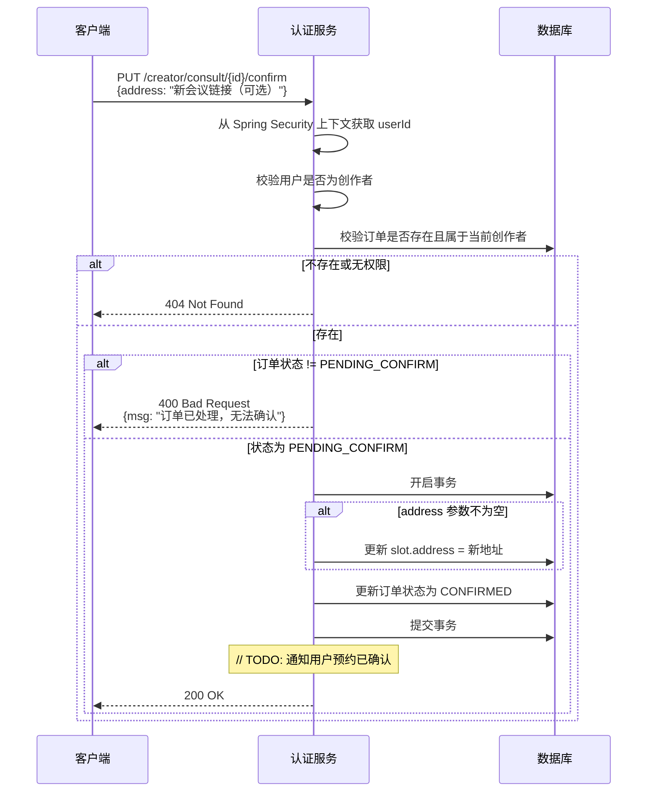
```mermaid
sequenceDiagram
    participant Client as 客户端
    participant Auth as 认证服务
    participant DB as 数据库

    Client->>Auth: PUT /creator/consult/{id}/confirm<br/>{address: "新会议链接（可选）"}
    Auth->>Auth: 从 Spring Security 上下文获取 userId
    Auth->>Auth: 校验用户是否为创作者
    Auth->>DB: 校验订单是否存在且属于当前创作者
    alt 不存在或无权限
        Auth-->>Client: 404 Not Found
    else 存在
        alt 订单状态 != PENDING_CONFIRM
            Auth-->>Client: 400 Bad Request<br/>{msg: "订单已处理，无法确认"}
        else 状态为 PENDING_CONFIRM
            Auth->>DB: 开启事务
            alt address 参数不为空
                Auth->>DB: 更新 slot.address = 新地址
            end
            Auth->>DB: 更新订单状态为 CONFIRMED
            Auth->>DB: 提交事务
            Note over Auth: // TODO: 通知用户预约已确认
            Auth-->>Client: 200 OK
        end
    end
```

### 拒绝预约

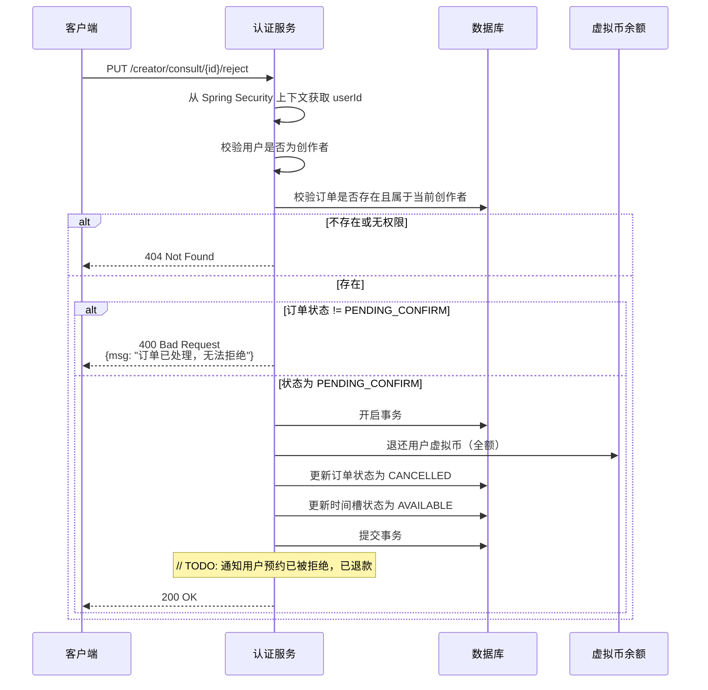
```mermaid
sequenceDiagram
    participant Client as 客户端
    participant Auth as 认证服务
    participant DB as 数据库
    participant Balance as 虚拟币余额

    Client->>Auth: PUT /creator/consult/{id}/reject
    Auth->>Auth: 从 Spring Security 上下文获取 userId
    Auth->>Auth: 校验用户是否为创作者
    Auth->>DB: 校验订单是否存在且属于当前创作者
    alt 不存在或无权限
        Auth-->>Client: 404 Not Found
    else 存在
        alt 订单状态 != PENDING_CONFIRM
            Auth-->>Client: 400 Bad Request<br/>{msg: "订单已处理，无法拒绝"}
        else 状态为 PENDING_CONFIRM
            Auth->>DB: 开启事务
            Auth->>Balance: 退还用户虚拟币（全额）
            Auth->>DB: 更新订单状态为 CANCELLED
            Auth->>DB: 更新时间槽状态为 AVAILABLE
            Auth->>DB: 提交事务
            Note over Auth: // TODO: 通知用户预约已被拒绝，已退款
            Auth-->>Client: 200 OK
        end
    end
```

### 标记完成

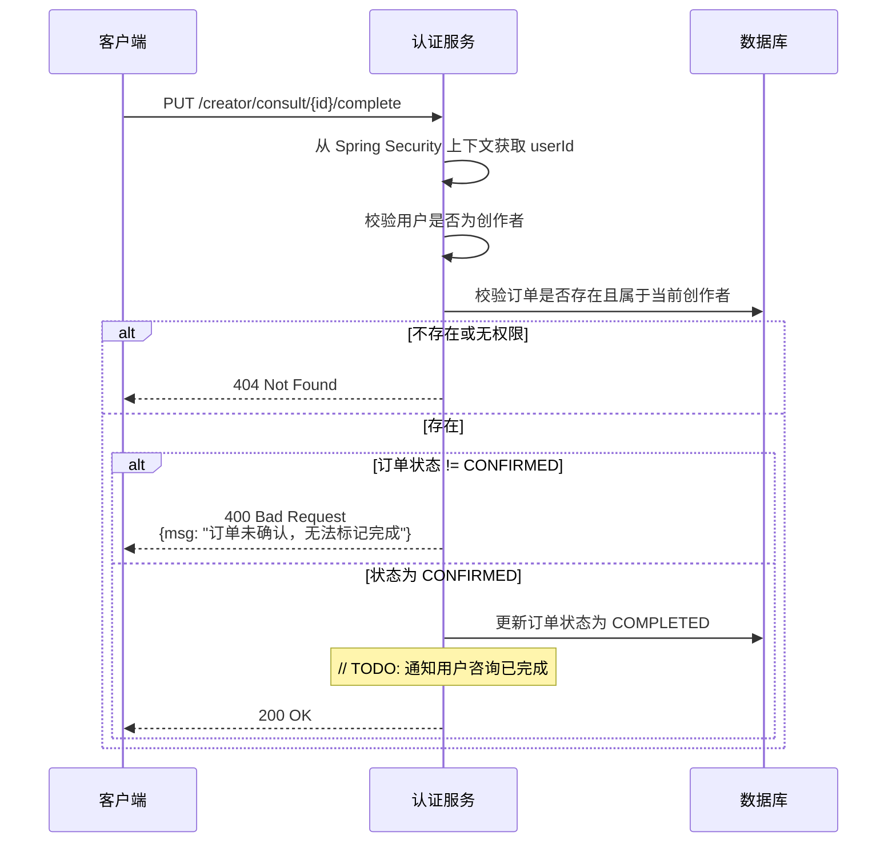
```mermaid
sequenceDiagram
    participant Client as 客户端
    participant Auth as 认证服务
    participant DB as 数据库

    Client->>Auth: PUT /creator/consult/{id}/complete
    Auth->>Auth: 从 Spring Security 上下文获取 userId
    Auth->>Auth: 校验用户是否为创作者
    Auth->>DB: 校验订单是否存在且属于当前创作者
    alt 不存在或无权限
        Auth-->>Client: 404 Not Found
    else 存在
        alt 订单状态 != CONFIRMED
            Auth-->>Client: 400 Bad Request<br/>{msg: "订单未确认，无法标记完成"}
        else 状态为 CONFIRMED
            Auth->>DB: 更新订单状态为 COMPLETED
            Note over Auth: // TODO: 通知用户咨询已完成
            Auth-->>Client: 200 OK
        end
    end
```

## 请求预约

用户端预约接口，前缀都为 `/user`：

| 业务动作   | Controller 方法      | 路径                     | 方法   | 入参                           | 出参类                     | 状态  |
| ------ | ------------------ | ---------------------- | ---- | ---------------------------- | ----------------------- | --- |
| 发起预约   | `saveConsult`      | `/consult`             | POST | `ConsultDTO`                 | `ConsultOrderVO`        |     |
| 查询我的预约 | `getMyConsultPage` | `/consult/page`        | GET  | `ConsultPageQuery`           | `IPage<ConsultOrderVO>` |     |
| 取消预约   | `cancelConsult`    | `/consult/{id}/cancel` | PUT  | 路径参数 `id`                    | `Void`                  |     |
| 申请退款   | `applyRefund`      | `/consult/{id}/refund` | PUT  | 路径参数 `id` + `RefundApplyDTO` | `Void`                  |     |

> [!TODO]
> 1. 缺少一个用户端的查询时间槽接口
#### 发起预约

```json
// ConsultDTO：预约请求
{
  "slotId": 1,                    // 时间槽ID（必填）
  "message": "想咨询一下技术问题"   // 留言（必填）
}
```

```json
// ConsultOrderVO 出参
{
  "id": 1,
  "slotId": 1,
  "date": "2026-04-01",
  "startTime": "10:00",
  "endTime": "11:00",
  "price": 50,
  "status": "PENDING_CONFIRM",
  // 注意这里要设为 null，不要直接传
  "address": null,
  "creatorId": 88,
  "creatorName": "后端架构师",
  "creatorAvatar": "https://...",
  "message": "想咨询一下技术问题",
  "createTime": 1711425600000
}
```

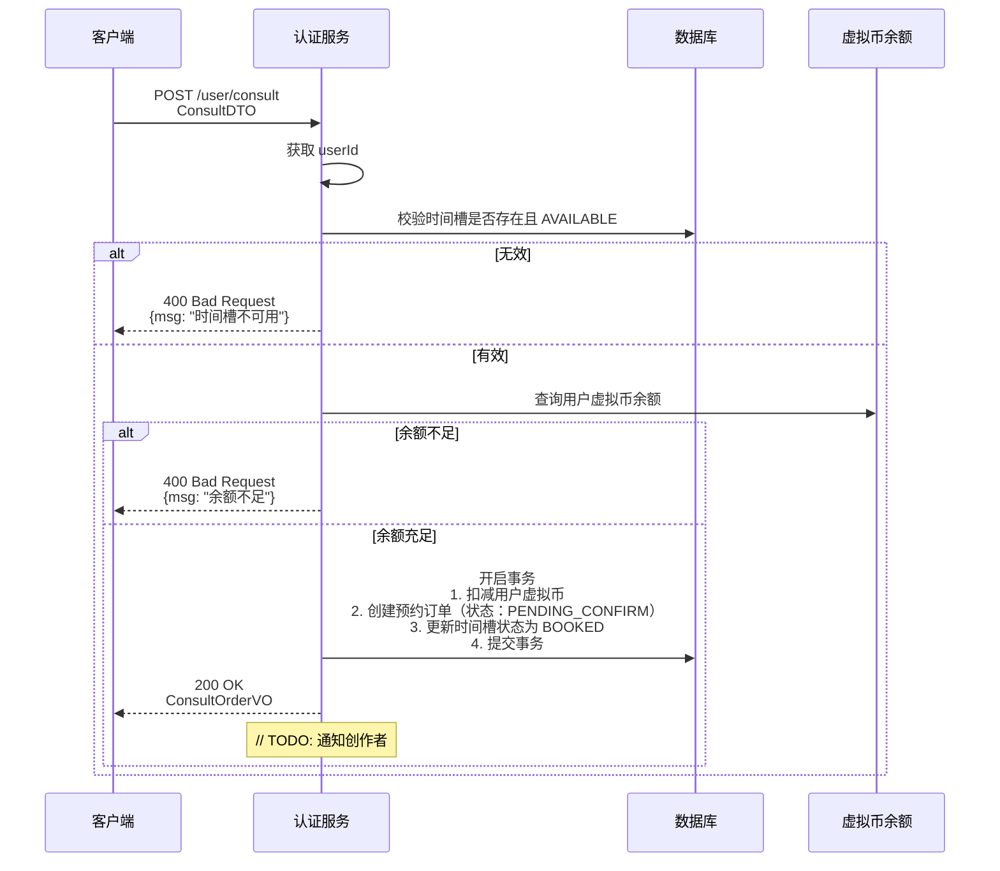
```mermaid
sequenceDiagram
    participant Client as 客户端
    participant Auth as 认证服务
    participant DB as 数据库
    participant Balance as 虚拟币余额

    Client->>Auth: POST /user/consult<br/>ConsultDTO
    Auth->>Auth: 获取 userId
    Auth->>DB: 校验时间槽是否存在且 AVAILABLE
    alt 无效
        Auth-->>Client: 400 Bad Request<br/>{msg: "时间槽不可用"}
    else 有效
        Auth->>Balance: 查询用户虚拟币余额
        alt 余额不足
            Auth-->>Client: 400 Bad Request<br/>{msg: "余额不足"}
        else 余额充足
            Auth->>DB: 开启事务<br/>1. 扣减用户虚拟币<br/>2. 创建预约订单（状态：PENDING_CONFIRM）<br/>3. 更新时间槽状态为 BOOKED<br/>4. 提交事务
            Auth-->>Client: 200 OK<br/>ConsultOrderVO
            Note over Auth: // TODO: 通知创作者
        end
    end
```

#### 查询我的预约

```json
// ConsultPageQuery：继承 PageQuery
{
  "status": "PENDING", // 可选，见状态图
  "pageNum": 1,
  "pageSize": 10
}
```

出参的 `CounsultOrderVO` 见上一个接口。

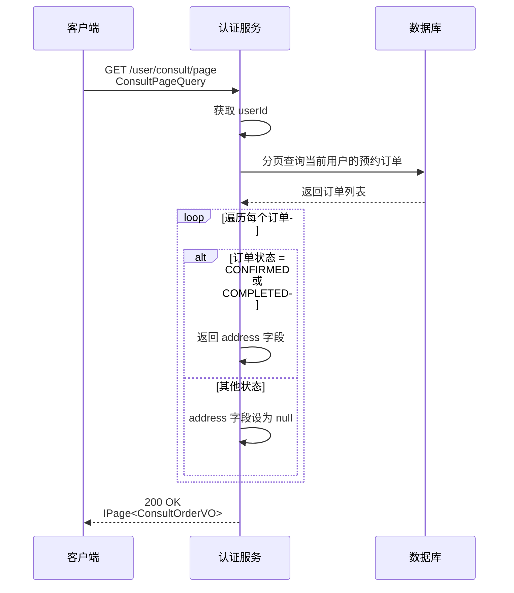
```mermaid
sequenceDiagram
    participant Client as 客户端
    participant Auth as 认证服务
    participant DB as 数据库

    Client->>Auth: GET /user/consult/page<br/>ConsultPageQuery
    Auth->>Auth: 获取 userId
    Auth->>DB: 分页查询当前用户的预约订单
    DB-->>Auth: 返回订单列表

    loop 遍历每个订单
        alt 订单状态 = CONFIRMED 或 COMPLETED
            Auth->>Auth: 返回 address 字段
        else 其他状态
            Auth->>Auth: address 字段设为 null
        end
    end

    Auth-->>Client: 200 OK<br/>IPage<ConsultOrderVO>
```

#### 取消预约

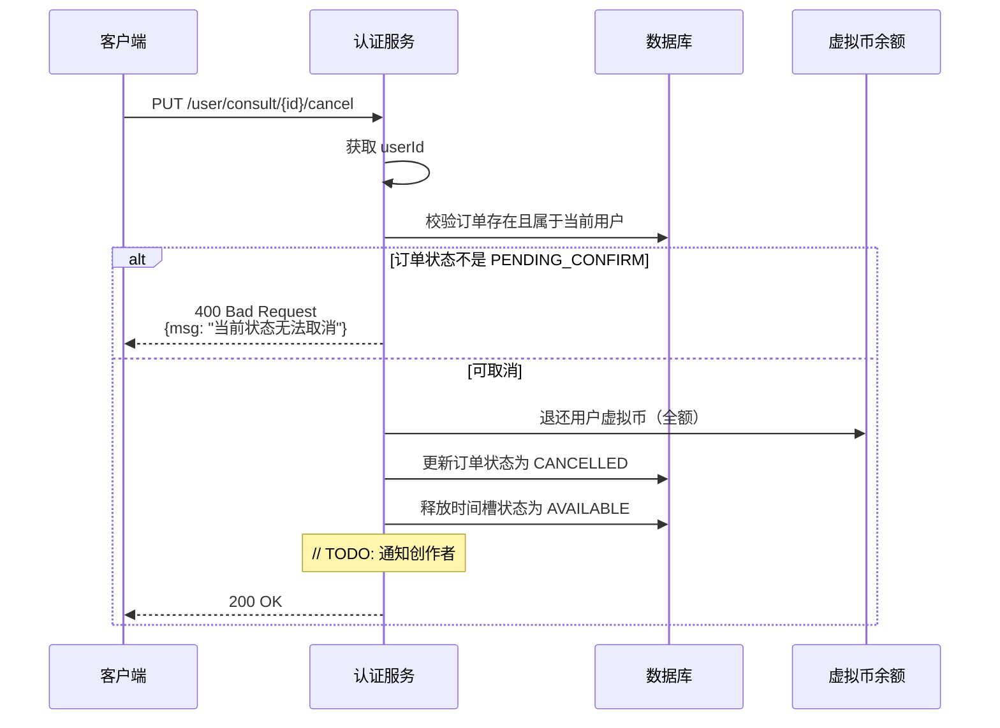
```mermaid
sequenceDiagram
    participant Client as 客户端
    participant Auth as 认证服务
    participant DB as 数据库
    participant Balance as 虚拟币余额

    Client->>Auth: PUT /user/consult/{id}/cancel
    Auth->>Auth: 获取 userId
    Auth->>DB: 校验订单存在且属于当前用户
    alt 订单状态不是 PENDING_CONFIRM
        Auth-->>Client: 400 Bad Request<br/>{msg: "当前状态无法取消"}
    else 可取消
        Auth->>Balance: 退还用户虚拟币（全额）
        Auth->>DB: 更新订单状态为 CANCELLED
        Auth->>DB: 释放时间槽状态为 AVAILABLE
        Note over Auth: // TODO: 通知创作者
        Auth-->>Client: 200 OK
    end
```

### 申请退款

```json
// RefundApplyDTO
{ // 后续扩展使用
  "reason": "咨询质量不好，未解决我的问题"   // 退款原因（必填）
}
```

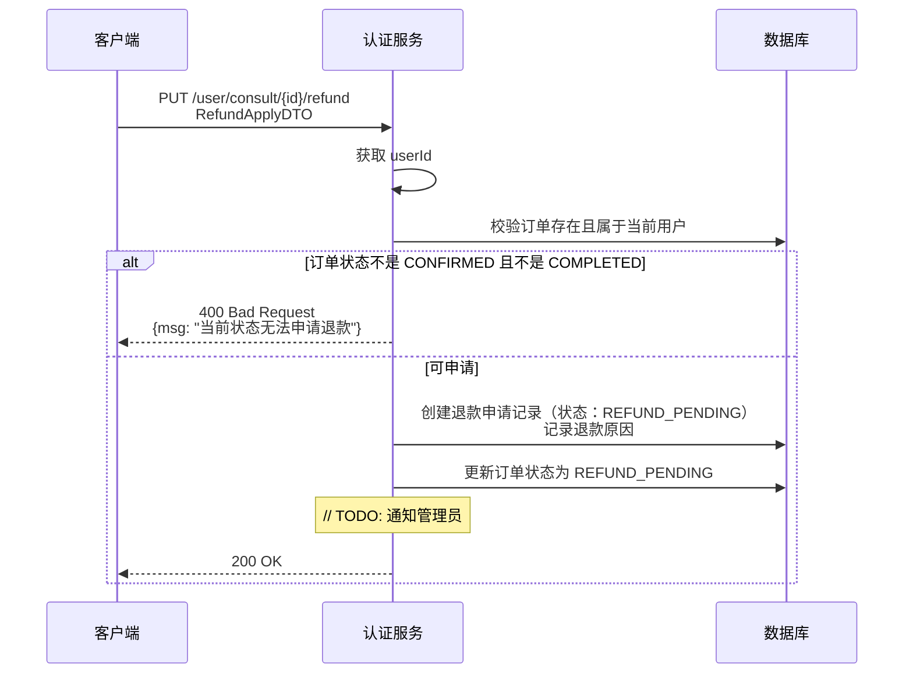
```mermaid
sequenceDiagram
    participant Client as 客户端
    participant Auth as 认证服务
    participant DB as 数据库

    Client->>Auth: PUT /user/consult/{id}/refund<br/>RefundApplyDTO
    Auth->>Auth: 获取 userId
    Auth->>DB: 校验订单存在且属于当前用户
    alt 订单状态不是 CONFIRMED 且不是 COMPLETED
        Auth-->>Client: 400 Bad Request<br/>{msg: "当前状态无法申请退款"}
    else 可申请
        Auth->>DB: 创建退款申请记录（状态：REFUND_PENDING）<br/>记录退款原因
        Auth->>DB: 更新订单状态为 REFUND_PENDING
        Note over Auth: // TODO: 通知管理员
        Auth-->>Client: 200 OK
    end
```

## 管理员退款

目前暂时支持咨询订单退款，前缀为 `/admin`：

| 业务动作     | Controller 方法      | 路径                    | 方法 | 入参              | 出参类                 | 状态 |
| ------------ | -------------------- | ----------------------- | ---- | ----------------- | ---------------------- | ---- |
| 退款申请分页 | `getRefundApplyPage` | `/consult/refund/page`  | GET  | `RefundPageQuery` | `IPage<RefundApplyVO>` |      |
| 审核退款     | `auditRefund`        | `/consult/refund/audit` | PUT  | `RefundAuditDTO`  | `Void`                 |      |

### 退款申请分页

```json
// RefundPageQuery：继承 PageQuery
{
  "status": "REFUND_PENDING",     // 可选，默认 REFUND_PENDING
  "pageNum": 1,
  "pageSize": 10
}
```

```json
// RefundApplyVO 出参
{
  "id": 1,
  "orderId": 1,
  "slotId": 1,
  "date": "2026-04-01",
  "startTime": "10:00",
  "endTime": "11:00",
  "price": 50,
  "orderStatus": "CONFIRMED",     // 申请时的订单状态
  "userId": 1001,
  "userNickname": "听众_8848",
  "userAvatar": "https://...",
  "creatorId": 88,
  "creatorName": "后端架构师",
  "reason": "咨询质量不好，未解决我的问题",
  "applyTime": 1711425600000
}
```

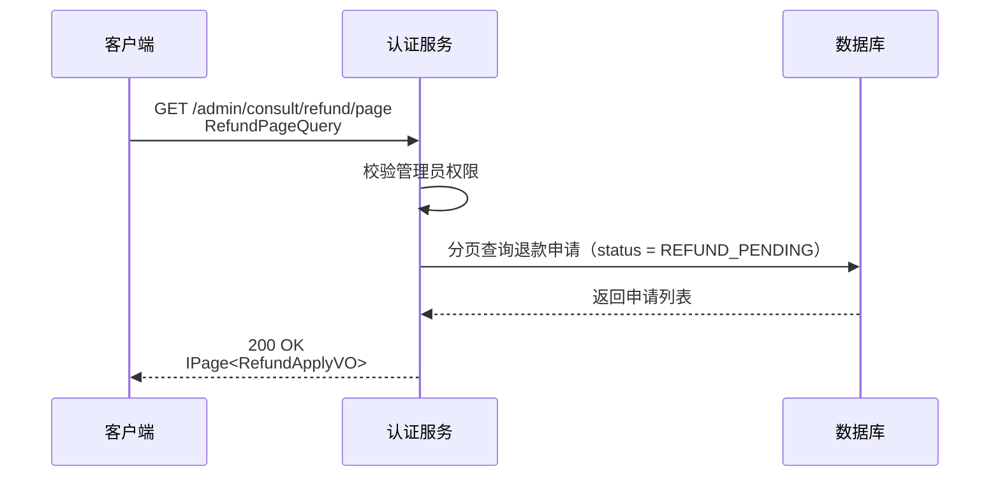
```mermaid
sequenceDiagram
    participant Client as 客户端
    participant Auth as 认证服务
    participant DB as 数据库

    Client->>Auth: GET /admin/consult/refund/page<br/>RefundPageQuery
    Auth->>Auth: 校验管理员权限
    Auth->>DB: 分页查询退款申请（status = REFUND_PENDING）
    DB-->>Auth: 返回申请列表
    Auth-->>Client: 200 OK<br/>IPage<RefundApplyVO>
```

### 审核退款

```json
// RefundAuditDTO
{
  "applyId": 1,                   // 退款申请ID（必填）
  "approved": true,               // true-通过 false-拒绝
  "rejectReason": "理由"           // 拒绝时必填
}
```

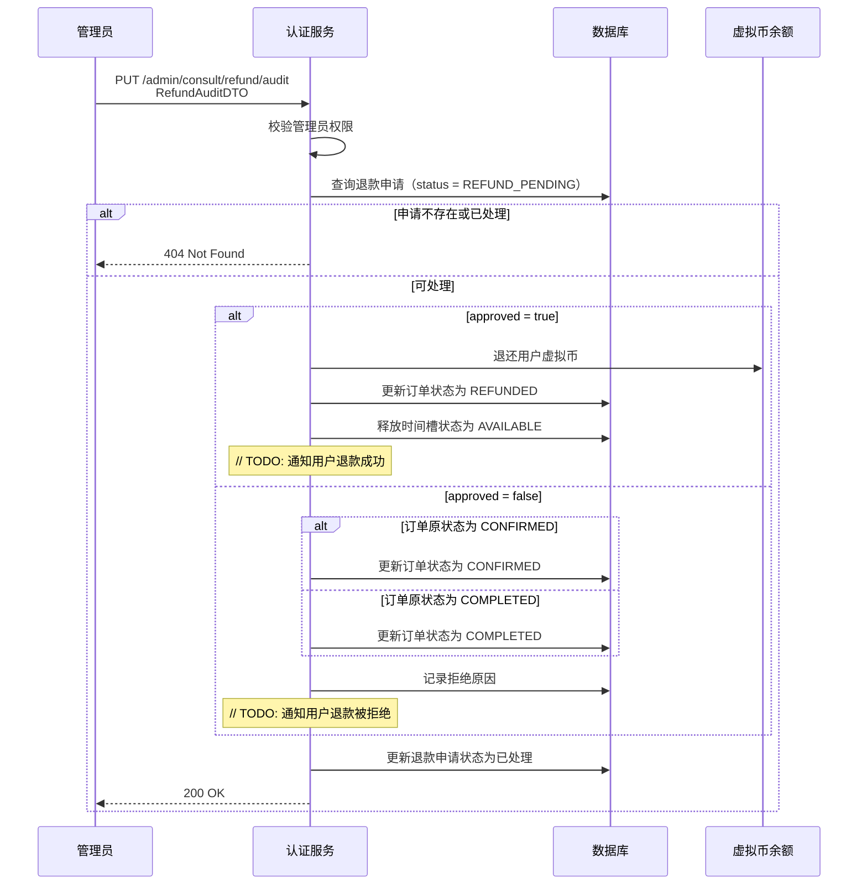
```mermaid
sequenceDiagram
    participant Admin as 管理员
    participant Auth as 认证服务
    participant DB as 数据库
    participant Balance as 虚拟币余额

    Admin->>Auth: PUT /admin/consult/refund/audit<br/>RefundAuditDTO
    Auth->>Auth: 校验管理员权限
    Auth->>DB: 查询退款申请（status = REFUND_PENDING）
    alt 申请不存在或已处理
        Auth-->>Admin: 404 Not Found
    else 可处理
        alt approved = true
            Auth->>Balance: 退还用户虚拟币
            Auth->>DB: 更新订单状态为 REFUNDED
            Auth->>DB: 释放时间槽状态为 AVAILABLE
            Note over Auth: // TODO: 通知用户退款成功
        else approved = false
            alt 订单原状态为 CONFIRMED
                Auth->>DB: 更新订单状态为 CONFIRMED
            else 订单原状态为 COMPLETED
                Auth->>DB: 更新订单状态为 COMPLETED
            end
            Auth->>DB: 记录拒绝原因
            Note over Auth: // TODO: 通知用户退款被拒绝
        end
        Auth->>DB: 更新退款申请状态为已处理
        Auth-->>Admin: 200 OK
    end
```
